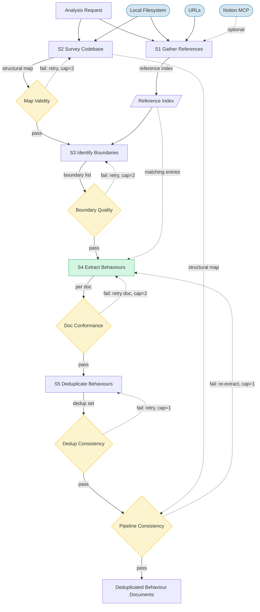
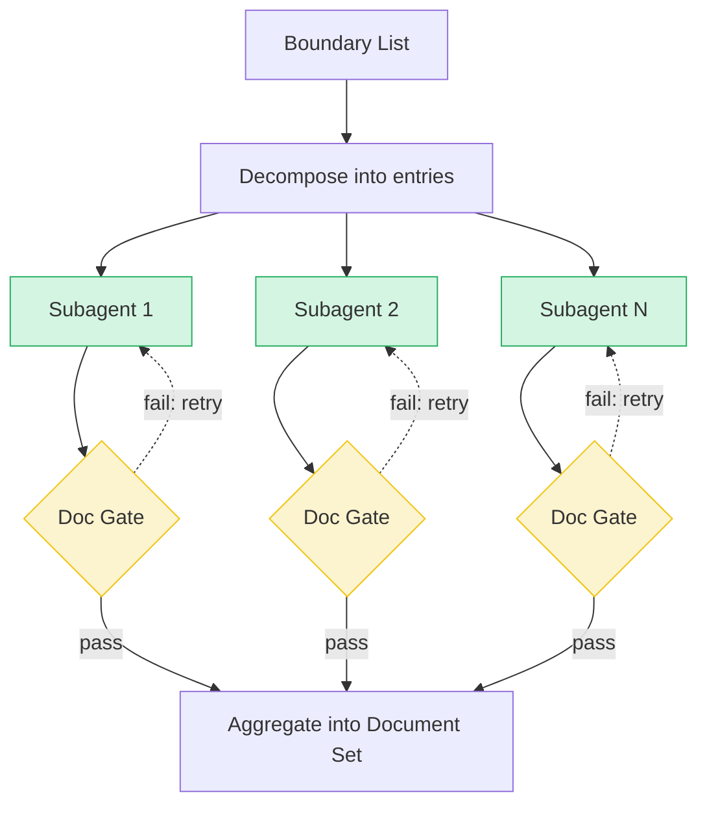

# Pipeline Design: Behaviour Extraction from Source Code

## Overview

This pipeline extracts structured behaviour documents from a microservice codebase by surveying its structure, identifying decision boundaries (places where the system chooses between outcomes), and producing one behaviour document per boundary following a standardised template. It optionally accepts reference documents (design docs, PRDs, user stories) to inform the extraction. The pipeline has 5 stages, 5 validation gates, 5 balancing feedback loops, and a decompose-aggregate fan-out at Stage 4 for parallel extraction. No external write targets — all output is local markdown files.

## Pipeline Flow

## Stages

### Stage 1: Gather References
- **Category**: Enrich
- **Intent**: Load optional reference documents into a structured reference index
- **Input**: Reference list from Analysis Request (may be empty)
- **Output**: Reference Index — structured entries with source attribution and topic tags
- **Sources**: Local filesystem, URLs, Notion MCP (requires MCP server configured)
- **Sinks**: None
- **Context budget**: Minimal — reference locators + retrieval instructions only. No domain knowledge or template guidance. Retrieval is tool-based (file read, web fetch, Notion MCP calls).

### Stage 2: Survey Codebase
- **Category**: Extract
- **Intent**: Build a structural map of the target code
- **Input**: Target scope from Analysis Request
- **Output**: Codebase Structural Map — files, constructs (functions/methods/classes), signatures, call relationships, test file mapping
- **Sources**: Local filesystem (source code files)
- **Sinks**: None
- **Context budget**: Target scope + test naming conventions by language. One example of structural map output. No reference documents or boundary heuristics. For large repos, processes files iteratively.

### Stage 3: Identify Boundaries
- **Category**: Extract
- **Intent**: Select decision boundaries worth documenting from the structural map
- **Input**: Codebase Structural Map + Reference Index (passthrough, for heuristic sensitivity)
- **Output**: Boundary List — location, type (enum), decision summary, verbatim evidence snippet, reference hints
- **Sources**: Local filesystem (re-reads source files at candidate locations)
- **Sinks**: None
- **Context budget**: Structural map as scanning index + Reference Index as bias signal. 6 heuristics and 4 exclusion criteria inlined. 2-3 examples (include/exclude judgments). No template or deduplication guidance.

### Stage 4: Extract Behaviours
- **Category**: Transform (fan-out — one subagent per boundary)
- **Intent**: Produce one behaviour document per decision boundary
- **Input**: Single boundary entry + source code + test files + matching Reference Index entries + behaviour template
- **Output**: One behaviour document following `behaviour-template.md`
- **Sources**: Local filesystem (re-reads code and test files)
- **Sinks**: None
- **Context budget**: Per-boundary context is small and focused — one boundary entry, surrounding code, test file, filtered reference entries, template + extraction guidance, one filled-in example. No other boundaries, no structural map.

### Stage 5: Deduplicate Behaviours
- **Category**: Evaluate
- **Intent**: Detect and merge behaviour documents covering the same decision
- **Input**: Full Behaviour Document Set from Stage 4
- **Output**: Deduplicated set + deduplication report (merge records with rationale)
- **Sources**: None
- **Sinks**: None
- **Context budget**: Full document set (~30 docs, ~6k lines). Merge rules + report format. No upstream history or structural map.

## Artifacts

### Pipeline Input → Stage 1, Stage 2: Analysis Request
- `target_scope`: `{ mode: "specified"|"full_repo", paths: [...] }`
- `references`: `[{ type: "file"|"url"|"notion", locator: "..." }]` — may be empty

### Stage 1 → Stage 3, Stage 4: Reference Index
- Entries: `source_type` (enum), `source_locator` (identity), `title`, `content`, `topics[]`
- Identity fields: `source_type`, `source_locator`
- Omitted: original formatting, navigation, authorship metadata
- Routes to Stage 3 (full) and Stage 4 (filtered to matching `reference_hints`)

### Stage 2 → Stage 3, Post-Pipeline Gate: Codebase Structural Map
- Files with `path` (identity), `language`, constructs: `type` (enum), `name` (identity), `signature`, `line_range` (identity), `calls[]`
- `test_file` mapping per source file, `test_mapping_conventions`
- Identity fields: `path`, `name`, `line_range`
- Omitted: raw source code, comments, imports, type definitions

### Stage 3 → Stage 4: Boundary List
- Entries: `id` (sequential index), `location` (identity: file, function, line_range), `type` (enum: 6 values), `decision_summary` (one sentence), `evidence` (identity: verbatim ≤10 lines), `reference_hints[]`
- Identity fields: `location`, `evidence`
- Omitted: full function body, call graph, surrounding context

### Stage 4 → Stage 5: Behaviour Document Set
- Per document: `id` (BHV-hex), classification (`category` enum, `source`, `significance` enum, `status`), description, trigger, actors, contracts (pre/post/invariants/failure modes), scenarios (happy path required), traceability (`code_references`, `test_references`, `reference_hints`)
- Identity fields: `id`, all traceability fields
- Omitted: raw source code, structural map data, boundary metadata

### Pipeline Output: Deduplicated Behaviour Document Set
- Same structure as above + deduplication report: `total_extracted`, `duplicates_merged`, `final_count`, merge records

## Workflow: autodoc

### Gates

| Gate | Position | Type | Pass criteria | Failure route | Max retries |
|------|----------|------|---------------|---------------|-------------|
| Structural Map Validity | After Stage 2 | Schema + Metric | All files parsed, valid constructs, language detected, test mapping attempted | Retry Stage 2 with error details | 2 (escalate: proceed if ≥80% parsed) |
| Boundary Quality | After Stage 3 | Schema + Semantic | Valid enum types, accurate summaries (spot-check 3-5), no major coverage gaps (reconcile against structural map), exclusions justified (spot-check 2-3) | Retry Stage 3 with gaps/false positives | 2 (escalate: user manual review) |
| Document Conformance | After Stage 4 | Schema + Metric + Identity | Template structure, ≥1 scenario, ≥1 code ref, non-testable rationale, identity match to boundary | Retry single boundary extraction | 2 (escalate: include with warning) |
| Dedup Consistency | After Stage 5 | Schema | Count arithmetic, no lost documents, traceability links preserved | Retry Stage 5 | 1 (escalate: skip dedup, pass unmerged set) |
| Post-Pipeline Consistency | After Gate 4 | Semantic | No stale references, no orphaned behaviours. Coverage gaps reported but non-blocking. | Re-extract affected boundaries via Stage 4 → Stage 5 | 1 (escalate: flag with traceability warning) |

### Feedback Loops

All loops are **balancing** (gate-retry pattern). No reinforcing loops — appropriate for a one-pass extraction pipeline.

| Loop | Type | Stages | Cap | Degradation detector | Best-iteration selection |
|------|------|--------|-----|---------------------|--------------------------|
| Survey Retry | B | S2 → G1 → S2 | 2 | Parse count decrease between iterations | Highest parse count |
| Boundary Retry | B | S3 → G2 → S3 | 2 | Count swing >30% or issue count non-decreasing | Lowest issue count |
| Document Retry | B | S4 → G3 → S4 (per doc) | 2 | New failure types introduced | Fewer total gate failures |
| Dedup Retry | B | S5 → G4 → S5 | 1 | N/A (cap 1) | Compare original vs retry |
| Consistency Repair | B | G5 → S4 → S5 → G5 | 1 | Stale/orphaned count non-decreasing | Fewer stale/orphaned refs |

### Structural Pattern: Decompose-Aggregate (Stage 4)

Stage 4 fans out: the Boundary List is split into individual entries, each extracted in a parallel subagent. Gate 3 runs per-document within the fan-out. Results are aggregated into the Behaviour Document Set. No contradiction handling needed — boundaries map to independent code locations.

## Context Isolation

- **All stages** run in fresh, isolated subagent contexts. No stage sees prior stages' reasoning or conversation history.
- **Semantic gates** (Boundary Quality, Post-Pipeline Consistency) run in dedicated clean contexts with only the artifact under evaluation and validation criteria. They do not share the producing stage's context.
- **History policy**: No history at any stage — strictly enforced. The only information crossing stage boundaries is the explicitly specified artifacts.
- **Passthrough artifacts** (Reference Index, Structural Map) are routed by the orchestrator to consuming stages, not accumulated in a shared context.
- **Fan-out subagents** (Stage 4) each receive an independent, minimal context: one boundary entry + code + test file + filtered references + template.

## Cost Estimate

| Scenario | Inference Calls | Driver |
|----------|----------------|--------|
| Best case | ~36 | All gates pass. Stage 4: ~30 calls (one per boundary). |
| Realistic case | ~45 | A few Stage 4 document retries. |
| Worst case | ~135 | All retries fire, full consistency repair. Stage 4: up to 90 calls. |

Worst-to-best ratio: 3.75× (above 3× threshold, driven by Stage 4 fan-out retries — acceptable given deterministic gate criteria and template-guided extraction).
