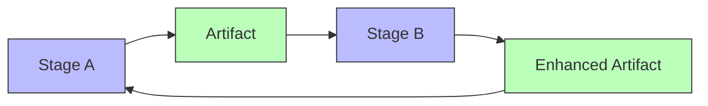
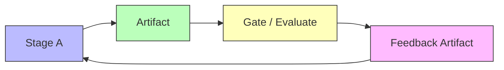
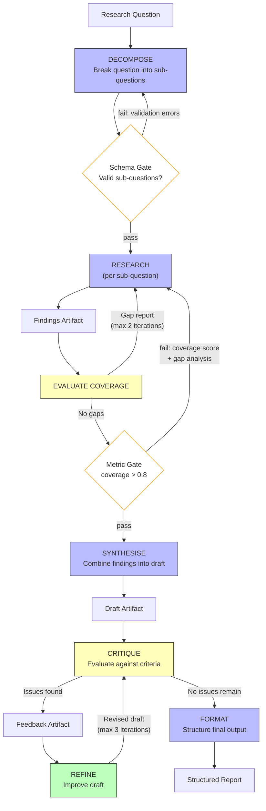
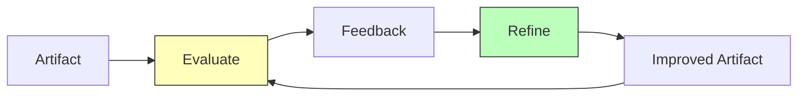
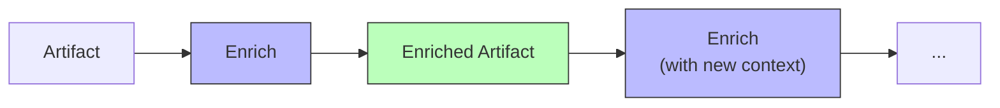
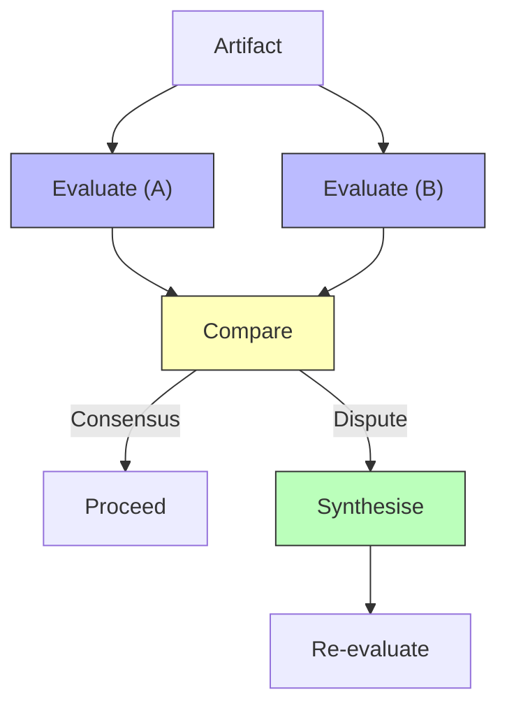
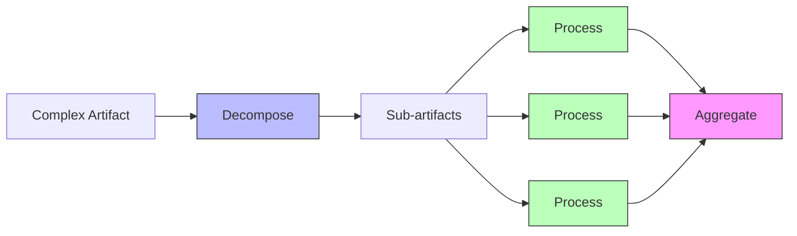
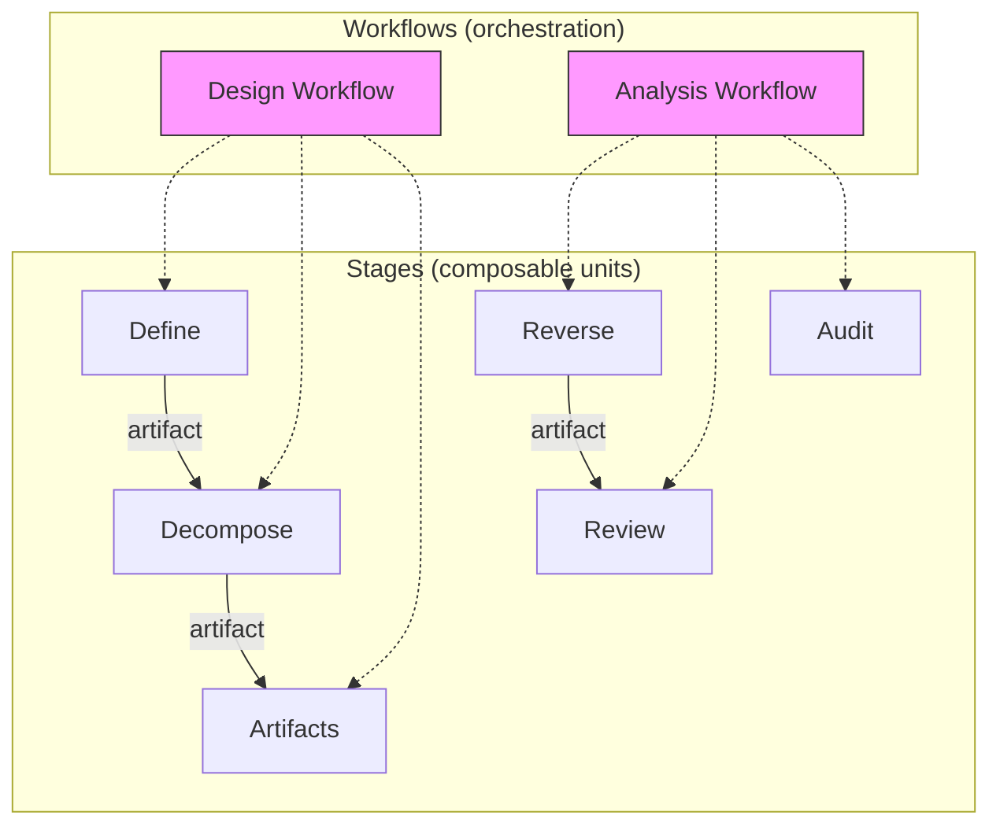

# The Loop Framework

## Designing Information Processing Pipelines with LLMs Through Feedback-Aware Staged Transformation

---

## 1. Design Motivation

Three observations converge to motivate this framework:

1. **LLM failure modes are dominated by reinforcing dynamics** (see `feedback-loops-in-llms.md`). The mechanisms that produce coherence and focus — autoregressive consistency, attention concentration — become reinforcing loops when they overshoot, driving outputs toward lock-in, amplification, and drift. The counterforces are almost always engineered (temperature, context management, human oversight), not inherent. When they are absent or overwhelmed, the reinforcing failure modes dominate.

2. **The context window is a finite-capacity channel** (see `information-flow-and-context.md`). The context window has an effective capacity far smaller than its nominal token limit. Noise and interference consume bandwidth, task complexity sets the minimum information rate, and what remains determines reasoning quality. These factors interact non-linearly — contradictory context (interference) is far more expensive than merely irrelevant context (noise), and overload can produce catastrophic failure rather than gradual degradation.

3. **Information processing tasks have natural decomposition points.** Most real-world tasks are not atomic — they involve sequential transformations where the output of one phase becomes the input to the next. Attempting to perform all transformations in a single inference pass overloads the context, triggers reinforcing loop pathologies, and produces brittle results.

The Loop framework addresses all three by providing **a design framework** for structuring LLM-based information processing as a pipeline of stages, each performing a bounded set of transformations on well-defined artifacts, with explicit feedback loops (reinforcing or balancing) designed into the connections between stages.

Loop is not a runtime framework or execution engine — it has no scheduler, no orchestrator library, no SDK. It is **a design framework for pipelines** — a lens that can be applied before, during, and after building. The framework does produce implementable artifacts: `/loop-implement` translates a completed design into Claude Code skills (structured prompt documents), which Claude Code then executes directly. The skills are the implementation, not a separate runtime layer.

Importantly, this is not a "design first, build later" framework. Design and implementation co-form: working through the framework produces understanding that changes the design; building reveals things the framework missed; running the pipeline surfaces dynamics that reshape both. The worksheets in this document are not a gate before implementation — they are a lens you apply iteratively as the pipeline and your understanding of it evolve together.

---

## 2. Core Principles

### 2.1 Staged Transformation

The [prompt chaining](https://www.anthropic.com/research/building-effective-agents) pattern decomposes a task into a sequence of steps where each LLM call processes the output of the previous one, "trading off latency for higher accuracy by making each LLM call an easier task." This is the right foundation. Loop takes the same structure and adds a design discipline around it.

The analogy is to a compiler, which transforms source code through a pipeline of stages: lexing → parsing → semantic analysis → IR generation → optimisation passes → code generation. Each stage:

- Operates on a **well-defined intermediate representation** (artifact)
- Performs a **bounded set of transformations**
- Produces output that is **ready for the next stage** without backtracking
- Can be **tested and validated independently**

The Loop framework applies this structure to LLM-based information processing. Instead of tokens → AST → IR → machine code, we have raw input → structured representation → refined model → validated output. Each stage's artifact is the "intermediate representation" consumed by the next.

### 2.2 The Unix Principle

Each stage should do one thing well. A stage that both extracts structure and evaluates quality is doing two things — split it. Stages compose through clean artifact interfaces, not shared implicit state.

From recent research applying Unix philosophy to agentic AI: instead of monolithic applications, we create "context managers" — programs that modify the information flowing between AI models. The pipeline is the program; each stage is a filter.

### 2.3 The Channel Capacity Budget

Each stage gets a **fresh context window** — not a "deliberately curated subset" of accumulated context, but an actually clean context that contains only the stage instructions, relevant contracts, and the input artifact. This is the key mechanism for managing information flow through the channel:

- **Information rate** is bounded by stage scope — each stage handles only its designated transformations, keeping the task's information rate within single-inference channel capacity
- **Noise** is minimised by passing only the relevant artifact, not the full history — reducing bandwidth wasted on irrelevant tokens
- **Signal bandwidth** is maximised by providing stage-specific scaffolding (instructions, examples, schemas) tailored to that stage's transformation — high-signal encoding aids

A single-pass approach forces the full task information rate through one channel. Staging decomposes it into manageable transmissions.

**Implementation requirement:** In Claude Code, fresh context per stage means **delegating each stage to a subagent** via the Agent tool. An orchestrator that executes stages in its own context accumulates every stage's working memory — file reads, intermediate reasoning, correction attempts — creating exactly the context pollution that staging is designed to prevent. By the final stage, the orchestrator's context window contains the full history of every prior stage, not just their output artifacts. The orchestrator should execute stages via subagents and retain only the orchestration-level information: which stages completed, gate results, and loop state. The subagent produces the output artifact in the workspace; the orchestrator reads the artifact (not the subagent's reasoning trace) to proceed.

### 2.4 Feedback Loops Are First-Class

Every connection between stages is an opportunity to design a feedback loop — reinforcing, balancing, or neither. The framework makes these explicit rather than leaving them as emergent side effects.

---

## 3. Framework Anatomy

### 3.1 The Two Levels

A Loop pipeline separates **what transforms data** from **how transformations are composed**:

**Stage level** (reusable, workflow-independent):

1. **Stages** — Isolated transformation units. A stage transforms an input artifact into an output artifact. It does not know what comes before or after it.
2. **Artifacts** — Typed intermediate representations. The data contracts between stages.
3. **Context Specs** — Per-stage channel capacity budgets. What goes into each stage's context window.
4. **Sources** — Declared external read dependencies. Where a stage accesses information from outside the pipeline (web, APIs, MCP servers, databases).
5. **Sinks** — Declared external write targets. Where a stage pushes data out of the pipeline (APIs, MCP servers, git, notification channels).

**Workflow level** (composition, defines how stages are wired):

6. **Gates** — Validation checkpoints placed between stages. Where errors are caught and where failures route.
7. **Loops** — Explicit feedback connections between stages. Reinforcing or balancing, with termination conditions.
8. **Workflows** — The composition itself: which stages run in what order, with which gates and loops. Includes precondition checks that validate external dependencies before execution begins.

A single set of stages can participate in multiple workflows. A conservative workflow might place strict gates and limit loops to 1 iteration. An exploratory workflow might use the same stages but with looser gates and 10-iteration reinforcing loops. The stages don't change — only the wiring does.

Above both levels sits the **problem definition**: what the pipeline transforms, from what input to what output, and what makes the gap hard. One problem definition may spawn multiple stage sets or workflows.

### 3.2 Stages

A stage is a single LLM inference (or a small bounded set of inferences) that performs a coherent set of transformations. Each stage is an **isolated transformation** — it is self-contained (doesn't access other stages' state), composable (doesn't know its position in a workflow), and has declared interfaces (inputs, outputs, source dependencies, and sink dependencies are explicit).

Each stage has:

| Property | Description |
|----------|-------------|
| **Input artifact** | The typed artifact this stage consumes |
| **Output artifact** | The typed artifact this stage produces |
| **Transformation intent** | What the stage does, stated as a verb phrase |
| **Context spec** | What goes into the context window for this stage |
| **Source dependencies** | External resources this stage reads from (if any) — see Section 3.7 |
| **Sink dependencies** | External targets this stage writes to (if any) — see Section 3.8 |

Note: a stage does not declare which loops or gates it participates in — that is defined at the workflow level (Section 3.6). A stage is a reusable unit that transforms its inputs into an output artifact.

**Stage categories** (not exhaustive, but covering common patterns):

| Category | Intent | Example |
|----------|--------|---------|
| **Extract** | Pull structure from unstructured input | Raw text → structured entities |
| **Enrich** | Add information to an existing artifact | Entities → entities with context |
| **Transform** | Convert between representations | Domain model → implementation plan |
| **Evaluate** | Assess quality against criteria | Draft → scored draft with issues |
| **Synthesise** | Combine multiple artifacts into one | Multiple analyses → unified report |
| **Refine** | Improve an artifact based on feedback | Draft + critique → improved draft |
| **Emit** | Push an artifact to an external target | Report → published report (via API, git, etc.) |

### 3.3 Artifacts

An artifact is a **typed, structured intermediate representation** passed between stages. Artifacts are the pipeline's data contract.

**Design requirements:**

- **Self-describing** — an artifact should carry enough metadata that any stage can determine what it contains and how to process it
- **Validatable** — there should be a way to check whether an artifact conforms to its type (schema validation, structural checks)
- **Serialisable** — artifacts must survive the boundary between stages (no implicit state)
- **Minimal** — an artifact should contain exactly what downstream stages need, no more

**Design worksheet — for each artifact, the designer should specify:**

| Question | Answer |
|----------|--------|
| What type of content does this carry? | *(e.g., structured entities, scored draft, gap analysis)* |
| What fields or structure does the downstream stage need? | |
| What can be omitted from the upstream stage's full output? | |
| How can this artifact be validated before passing it on? | *(schema check, required fields, score thresholds)* |
| Does the downstream stage need to know *why* the artifact looks this way? | *(If yes, include a reasoning trace. If no, omit it — it's noise in the downstream channel.)* |

The reasoning trace question is important: it allows downstream stages to understand *why* the artifact looks the way it does, without carrying the full context of the upstream stage. This is a form of **progressive disclosure** — each stage can inspect the trace if needed, but isn't forced to process it. The designer should decide per-artifact whether this is needed.

#### 3.3.1 Managing Handoff Drift

Context clearing at stage boundaries prevents the producing stage's trajectory from contaminating downstream inference. But the artifact itself still carries an information surface — every field that crosses the boundary is a dimension where drift can accumulate across stages. Even well-structured handoffs are not immune: the producing stage's biases, framings, and interpretive choices are encoded in the artifact's content. Over multiple stages, small interpretation shifts compound.

Three techniques reduce the interpretation surface of artifacts:

**Enumerate, don't describe.** Where possible, artifact fields should use values from closed sets rather than free text. "The sentiment is `negative`" carries less drift than "The tone feels dismissive and somewhat passive-aggressive." The first is a value from a finite vocabulary; the second invites reinterpretation at every downstream stage. Every free-text field in an artifact is an unmanaged surface. The design question for each field: can this be an enum, a score, or a reference instead of prose?

**Reference, don't paraphrase.** Artifacts should carry source locations (line numbers, section IDs, verbatim quotes) rather than the producing stage's interpretation of the source material. Let the consuming stage form its own interpretation from the original. When a stage must summarise, the summary should be clearly separated from the source references, so downstream stages can verify the interpretation against the original material.

**Separate observation from judgment.** If an artifact must carry both factual observations and evaluative conclusions, they should live in distinct fields. Mixing them creates a single surface where drift in judgment contaminates the factual record. A finding artifact with separate `evidence` (what was observed) and `assessment` (what it means) fields allows downstream stages to re-evaluate the assessment without the upstream stage's framing influencing their reading of the evidence.

#### 3.3.2 Artifact Identity and Re-grounding

In pipelines with many stages, cumulative drift across successive handoffs can shift the artifact away from the original input — even when each individual handoff is well-structured. Two mechanisms counter this:

**Artifact identity fields.** Designate a stable subset of fields as the artifact's "identity" — content that should pass through stages unchanged. These might include source references, original input identifiers, or constraint specifications. If an identity field mutates between stages, something has gone wrong. Identity fields should be mechanically checkable (exact match or hash comparison), not semantically evaluated.

**Periodic re-grounding.** For long pipelines (5+ stages), insert a re-grounding checkpoint that reads the original pipeline input alongside the current artifact and flags divergence. This is an explicit balancing loop against the source material, catching drift that no individual gate would detect because it accumulates gradually. Re-grounding does not mean re-processing — it means comparing the current artifact's claims against the original input to surface where interpretation has shifted.

#### 3.3.3 Gate Validation Context

The producing stage cannot reliably audit its own output for drift — it operates within the drifted context that produced the artifact. Artifact validation should therefore happen in one of two ways:

- **Mechanical validation** (schema checks, field type checks, identity field comparison) — deterministic, operates outside any LLM context, and is immune to drift.
- **Semantic validation in a clean context** — when an LLM must evaluate artifact quality, the evaluation should happen in a separate, minimal context that contains only the artifact, the validation criteria, and (where relevant) the original source material. The evaluator should not share context with the producing stage. In Claude Code, this means semantic gates must run in a **dedicated subagent**, not inline in the orchestrator or (worse) in the same subagent that produced the artifact.

This is the gate design principle: **validate at the gate, not at the stage.** The producing stage's job is to produce; the gate's job is to validate. Combining both in the same inference allows the producing stage's trajectory to bias the validation. An orchestrator that runs a stage and then "evaluates with fresh eyes" in the same context is not performing semantic validation — it is performing self-review, which is unreliable because the reasoning trajectory that produced the artifact is still in context.

### 3.4 Gates (Workflow Level)

A gate is a **validation checkpoint** between stages that determines whether an artifact is ready to proceed. Gates are defined at the workflow level, not the stage level — the same artifact boundary might have a strict semantic gate in one workflow and no gate in another. The prompt chaining guide recommends "programmatic checks on intermediate steps to ensure the process is still on track" — gates formalise this. They are the primary mechanism for preventing reinforcing loops from propagating errors downstream.

**Design worksheet — for each gate, the designer should specify:**

| Question | Answer |
|----------|--------|
| What must be true for this artifact to proceed? | |
| What type of check is this? | *(schema, semantic, metric, consensus)* |
| On failure, which stage receives the feedback? | |
| What information does the failure carry to that stage? | |
| What is the maximum number of retries before escalation? | |

**Gate types:**

| Type | Mechanism | Example |
|------|-----------|---------|
| **Schema gate** | Structural validation (deterministic) | JSON schema check, required fields present |
| **Semantic gate** | LLM-based quality assessment | "Does this summary accurately represent the source?" |
| **Metric gate** | Quantitative threshold | Confidence score > 0.8, word count within range |
| **Consensus gate** | Agreement between multiple evaluations | 2 of 3 independent assessments agree |
| **Human gate** | Human review and decision | Approval before irreversible action, judgment call on ambiguous quality |

Schema gates are cheap and deterministic — use them first. Semantic gates are expensive but catch issues that structural validation cannot. Human gates are the most reliable but the least scalable — reserve them for high-stakes decisions where automated validation is insufficient. Layer gate types: a schema gate catches structural problems before a semantic gate spends an inference call, and a human gate only fires when automated gates can't make the call.

**Detecting silent omission.** The most common failure mode that gates miss is not malformed output but *incomplete* output — an extraction stage that finds 3 of 10 entities, a summary that covers 2 of 5 key points. The artifact is structurally valid (a list of entities is a list of entities regardless of length), so schema gates pass. The content looks reasonable, so semantic gates may pass too — an LLM evaluator reviewing a summary doesn't know what was left out unless it has access to the source material.

Strategies for catching omission:

- **Coverage metrics.** When the input has a known or estimable scope (number of sections in a document, number of items in a list, number of topics mentioned), a metric gate can check that the output covers a minimum fraction. This requires the artifact to carry a coverage indicator — e.g., "extracted 7 entities from 12 paragraphs" — which the producing stage must be instructed to include.
- **Source-artifact reconciliation.** A semantic gate that receives both the artifact *and* the original source can check what was missed. This is more expensive (the gate's context must include the source), but it catches omissions that coverage metrics cannot — items that were present but not counted, nuances that were flattened.
- **Minimum cardinality checks.** For extraction stages where the expected output size is roughly predictable, a metric gate with a floor ("at least N entities" or "at least N% of input sections represented") catches gross omission cheaply.

The designer should ask for each gate: "This gate checks that the artifact is *correct*. Does it also check that the artifact is *complete*?" If the answer is no and completeness matters, add a coverage or reconciliation check.

### 3.5 Loops (Workflow Level)

A loop is an **explicit feedback connection** between stages, defined at the workflow level. The same stages might participate in a 10-iteration reinforcing loop in one workflow and a 2-iteration balancing loop in another — the stages don't change, only the wiring. Every loop has a declared type:

**Reinforcing loops (R)** — designed to amplify and deepen:



Use when: you want iterative enrichment, progressive elaboration, or cumulative refinement. Each pass through the loop should demonstrably add value.

*Example:* Summarize → Elaborate → Summarize (re-summarize with added detail) → Elaborate (expand on the richer summary)

> **Watch for compound dynamics.** If a stage in a reinforcing loop also filters or rejects input (e.g., an Extract stage that drops low-confidence items), it introduces a hidden balancing dynamic. Decompose these into separate R and B loops with their own termination conditions — this makes each loop's intent legible and independently tunable. Avoid modeling a single loop as compound (R+B); the mixed dynamics make termination conditions harder to reason about and degradation harder to detect.

**Balancing loops (B)** — designed to correct and constrain:



Use when: you want quality control, error correction, or constraint enforcement. Each pass through the loop should reduce the distance between the artifact and the desired state.

*Example:* Draft → Evaluate (against criteria) → Feedback → Refine → re-Evaluate

**Every loop MUST have:**

- A **declared type** (R or B) — making the designer's intent explicit
- A **termination condition** — preventing unbounded iteration
- A **maximum iteration count** — hard backstop even if the termination condition has bugs
- A **degradation detector** — mechanism to detect when further iterations are making things worse, not better (essential for preventing reinforcing loops from running away). Because stages are stochastic, degradation detection should use a moving average or require consecutive regressions rather than triggering on a single iteration's decline (see Section 3.9)

### 3.6 Workflows

A workflow is a **composition of stages** — it defines which stages run, in what order, with which gates and loops. Workflows are the orchestration layer; stages are the execution layer.

A workflow specifies:

| Property | Description |
|----------|-------------|
| **Stage sequence** | Which stages, in what order |
| **Gate placement** | Which artifact boundaries have gates, and of what type |
| **Loop configuration** | Which feedback connections exist, with type, iteration bounds, and termination conditions |
| **Preconditions** | What must be true before the workflow starts — external dependency validation, configuration checks |
| **Name** | A descriptive name distinguishing this workflow from others over the same stages |

#### Preconditions

A precondition is a **readiness check** that validates the workflow's external dependencies before execution begins. Preconditions exist because discovering a misconfigured Notion integration at stage 7 wastes all the work of stages 1–6.

Preconditions are derived mechanically from the stages' declared sources and sinks:

| Dependency type | Precondition check |
|-----------------|-------------------|
| **API source/sink** | Auth token valid, endpoint reachable, required permissions present |
| **MCP server** | Server connected, required tools available |
| **Git sink** | Repository accessible, branch writable, no conflicting locks |
| **Notification sink** | Channel exists, bot/webhook configured, test message succeeds |
| **Database source/sink** | Connection established, required tables/collections exist |
| **Filesystem source/sink** | Paths exist (or are creatable), permissions sufficient |

**Design rule:** Precondition checks run before the first stage, not during it. A precondition failure produces a clear diagnostic ("Notion API token expired", "Slack channel #reviews not found") and prevents the workflow from starting. This is cheaper and clearer than a mid-pipeline failure.

Not all preconditions are binary pass/fail. Some are **degraded-mode checks**: the Slack notification sink is unavailable, but the pipeline can still run — it just won't notify. The designer should classify each precondition as **required** (workflow cannot start without it) or **optional** (workflow runs in degraded mode, with a warning about what won't work).

**Design rule:** When a stage is delegated to a subagent (e.g., parallel reviewer agents, orchestrator-worker decomposition), the orchestrator must propagate the stage's relevant preconditions to the subagent's prompt. A precondition validated in the main agent's environment does not guarantee the subagent has the same capability — subagents may run in isolated contexts with different tool access, network permissions, or MCP server connections. The orchestrator should explicitly instruct each subagent to use the required tools/resources, and where feasible, include a lightweight re-validation step (e.g., "perform a test web search before beginning verification") in the subagent's instructions.

Multiple workflows can compose the same stages differently:

| Workflow | Stages | Loops | Use case |
|----------|--------|-------|----------|
| Conservative | A → B → C | B→A balancing, max 2 iterations | Production, high-stakes |
| Exploratory | A → B → C | B→A reinforcing, max 10 iterations | Research, idea generation |
| Minimal | A → C | None | Quick prototyping, skip enrichment |

The stages A, B, and C are defined once. Each workflow wires them differently.

**Design considerations:**
- Workflows should be **lightweight** — sequencing and configuration, not transformation logic. If a workflow contains substantial logic, it's a stage pretending to be a workflow.
- Gate criteria and loop iteration bounds are **per-workflow decisions**. A stage doesn't know whether it's being gated or looped — it just transforms its input artifact into its output artifact.
- A workflow that uses a subset of available stages is valid. Not every workflow needs every stage.

**Cost estimation.** Each workflow has an inference cost determined by its composition. The designer should estimate this before committing to a design:

- **Base cost** = number of stages (each stage is at least one inference call)
- **Gate cost** = number of semantic gates (each is an inference call) + number of consensus gates × evaluator count. Schema and metric gates are essentially free.
- **Loop cost** = for each loop, multiply the stages in the loop by the expected iteration count. Use the *average* case, not the maximum — but know the maximum.
- **Sink cost** = external API calls, notification sends, and other write operations. These may have per-call costs (API pricing) or rate limits that constrain throughput.
- **Worst-case cost** = base + all gates + all loops at maximum iterations + sink writes (including duplicated writes from loop re-entry). This is the ceiling for a single pipeline run.

For example, the research-to-report pipeline in Section 4.4 has 6 stages, 2 gates (1 schema, 1 metric — both cheap), and 2 balancing loops (max 2 and max 3 iterations). Best case: 6 calls. Worst case: 6 + 2 + 3×2 = 14 calls. If each call costs ~$0.05, that's $0.30–$0.70 per input. For a batch of 1000 inputs, the difference between a 2-stage and 14-stage pipeline is significant.

The cost estimate also reveals design tradeoffs: a consensus gate that triples gate cost may not be worth it if the upstream stage is already reliable. A 10-iteration enrichment loop that runs to completion on most inputs is a sign that the termination condition is too loose or the task needs restructuring. Cost is a signal about design quality, not just a budget constraint.

### 3.7 Sources (Stage Level)

A source is an **external resource** that a stage reads from to bring new information into the pipeline. Sources are declared as stage-level dependencies — a stage that needs web access declares it regardless of which workflow it participates in.

Sources are distinct from input artifacts: an input artifact is data that flows through the pipeline from an upstream stage; a source is data that enters the pipeline from outside it. Sources are also distinct from sinks (Section 3.8): a source is a read dependency; a sink is a write target.

**Source types:**

| Type | Examples | Failure modes |
|------|----------|---------------|
| **Web** | URLs, search queries, web scraping | Network errors, rate limits, content changes, unavailability |
| **API** | REST endpoints, GraphQL, gRPC services | Auth expiry, rate limits, schema changes, timeouts |
| **MCP Server** | Tool servers exposing structured capabilities | Connection failures, tool errors, capability changes |
| **Database** | SQL queries, document store lookups | Connection failures, query errors, stale data |
| **Filesystem** | Local files, configuration, reference documents | Missing files, permission errors, stale content |

**Why sources matter:**

- **Traceability** — sources make it explicit where external information enters the pipeline. Without declared sources, it's unclear which stages are pure transformations and which bring in new data.
- **Failure handling** — source failures are fundamentally different from transformation failures. A transformation failure means the LLM produced bad output; a source failure means external data was unavailable. They require different retry strategies and fallback paths.
- **Testability** — stages with no source dependencies can be tested with fixture artifacts alone. Stages with sources need mocks or live access, which changes the test strategy.
- **Cost and latency** — source access has costs (API calls, compute, network) and latency that pure transformations don't. Making sources explicit enables cost estimation and latency budgeting.

**Design worksheet — for each source dependency:**

| Question | Answer |
|----------|--------|
| What type of source is this? | *(web, API, MCP server, database, filesystem)* |
| What does this stage need from the source? | *(specific data, search results, tool output)* |
| What happens if the source is unavailable? | *(fail the stage, use cached data, skip, degrade gracefully)* |
| Is the source output deterministic? | *(same query always returns the same result, or is it time-varying?)* |
| Does this source have rate limits or cost implications? | |

A stage with no source dependencies is a **pure transformation** — it operates entirely on its input artifact and scaffolding. A stage with source dependencies is an **enriched transformation** — it combines its input artifact with external data. Both are valid; the distinction affects testing, failure handling, and cost. Stages may also have sink dependencies (Section 3.8), which add write side effects to either category.

### 3.8 Sinks (Stage Level)

A sink is an **external target** that a stage writes to, pushing data out of the pipeline. Sinks are the counterpart to sources (Section 3.7): sources bring information *in*; sinks push information *out*. Like sources, sinks are declared as stage-level dependencies — a stage that writes to Notion declares it regardless of which workflow it participates in.

Sinks are distinct from output artifacts: an output artifact is data that flows to a downstream stage within the pipeline; a sink write delivers data to an external system outside the pipeline.

**Sink types:**

| Type | Examples | Failure modes |
|------|----------|---------------|
| **API** | REST endpoints, GraphQL mutations, Notion pages | Auth expiry, rate limits, write conflicts, schema rejection |
| **MCP Server** | Tool servers accepting write operations | Connection failures, tool errors, permission denials |
| **Git** | Commits, branch pushes, PR creation | Merge conflicts, permission errors, hook failures |
| **Notification** | Slack messages, email, webhooks | Delivery failures, formatting errors, channel misconfiguration |
| **Filesystem** | Output files, reports, generated assets | Permission errors, disk space, path conflicts |
| **Database** | Inserts, updates, record creation | Constraint violations, connection failures, stale locks |

**Why sinks matter:**

- **Side effects are not retryable like transformations.** A failed transformation can be re-run freely — it only produces an artifact. A failed stage that already wrote to a sink may have partially completed the write. Re-running the stage risks duplicating the side effect (double-posting to Slack, creating duplicate Notion pages, committing twice). Sink-aware design must address idempotency.
- **Gate failures after sink writes cannot undo the write.** If a stage writes to a sink and then a downstream gate fails and routes back for correction, the sink write has already happened. The pipeline designer must decide: does the corrected re-run overwrite, append, or skip the sink write? This is a design decision that pure-transformation pipelines never face.
- **Testability** — stages with sink dependencies need mocks or sandbox environments. You don't want tests posting to production Slack or pushing to the main branch.
- **Observability** — sink writes are the pipeline's externally visible effects. Logging what was written, when, and whether it succeeded is essential for debugging and audit trails.

**Design worksheet — for each sink dependency:**

| Question | Answer |
|----------|--------|
| What type of sink is this? | *(API, MCP server, git, notification, filesystem, database)* |
| What does this stage write to the sink? | *(artifact content, status notification, generated file)* |
| Is the write idempotent? | *(Can the same write be safely repeated without duplication?)* |
| What happens if the write fails? | *(fail the stage, retry, buffer for later, skip and warn)* |
| What happens if a downstream gate fails after a successful write? | *(overwrite on re-run, append correction, no action needed)* |
| Does this sink have rate limits or cost implications? | |

#### 3.8.1 Notifications (A Sink Subtype)

A notification is a sink write whose purpose is to **signal pipeline state** rather than deliver a pipeline artifact. The distinction matters for failure handling: a notification failure should not block the pipeline. If a Slack message fails to send, the pipeline's transformation work is still valid — the human just wasn't informed.

Common notification triggers:
- **Human gate reached** — the pipeline needs human review before proceeding
- **Pipeline completion** — the final artifact is ready
- **Error escalation** — an automated gate failed and needs human attention
- **Progress milestones** — long-running pipelines reporting intermediate status

**Design rule:** Notifications are **fire-and-forget by default**. A notification failure should be logged but should not trigger gate failure, loop re-entry, or stage retry. If delivery confirmation is required (e.g., a human must acknowledge before the pipeline proceeds), that is not a notification — it is a human gate with a notification mechanism, and the gate's failure handling applies.

#### 3.8.2 Stage Classification by External Dependencies

A stage's external dependencies determine its testing, retry, and failure-handling characteristics:

| Sources | Sinks | Classification | Characteristics |
|---------|-------|----------------|-----------------|
| None | None | **Pure transformation** | Fully deterministic inputs, freely retryable, testable with fixtures alone |
| Yes | None | **Enriched transformation** | Needs source mocks for testing, retry-safe (reads are idempotent) |
| None | Yes | **Emitting transformation** | Needs sink mocks for testing, retry requires idempotency consideration |
| Yes | Yes | **Enriched emitting transformation** | Most complex — needs both source and sink mocks, both read and write failure modes |

The classification is not a quality judgment — pipelines often legitimately need all four types. But the designer should be aware of which stages have side effects, because those stages behave differently under retry, gate failure, and loop re-entry.

### 3.9 Non-Determinism

LLM stages are stochastic. The same input, same context, same system prompt can produce different artifacts on different runs. This is not a bug to be eliminated — temperature and sampling diversity are what prevent trajectory lock-in (see `feedback-loops-in-llms.md` Section 3.1). But it has consequences that the pipeline designer must account for.

**Gates must tolerate variance.** A stage output that fails a gate might pass on re-run without any change to the input. Gate design should distinguish between deterministic failures (schema violations, missing required fields — these will always fail and indicate a real problem) and stochastic failures (semantic quality falling slightly below a threshold — these may pass on retry). The gate's failure routing should reflect this: deterministic failures route to the producing stage with corrective feedback; stochastic failures may warrant a simple retry before escalating.

**Loop convergence is probabilistic, not guaranteed.** A balancing loop where each iteration "should reduce the distance to the desired state" is an expected-value statement, not a per-iteration guarantee. Any single iteration might make things worse by chance. Design implications:

- **Don't terminate on single-iteration regression.** A degradation detector that fires on the first quality decrease is too sensitive — it will trigger on normal variance. Use a moving average or require consecutive regressions before concluding that the loop is degrading.
- **Don't assume monotonic improvement.** A loop that improves on iterations 1-3, regresses on iteration 4, and improves again on iteration 5 is behaving normally. One that oscillates (good-bad-good-bad) may have a structural problem — the refine step may be undoing what the previous refine step did, which is a different failure mode from random variance.
- **Set iteration bounds conservatively.** Because each iteration has a chance of regression, more iterations mean more opportunities for the loop to end in a worse state than an earlier iteration. If you can't detect and select the best iteration's output, keep bounds tight.

**Artifact identity fields can mutate spontaneously.** Section 3.3.2 introduces identity fields — content that should pass through stages unchanged. With deterministic stages, identity mutation always signals a bug. With stochastic stages, a stage might rephrase or reformat an identity field without intending to change it. Mechanical checks (exact string match, hash comparison) catch this reliably; semantic checks ("is this still the same meaning?") are themselves stochastic and unreliable for identity verification.

**Testing is statistical, not binary.** A deterministic pipeline either works or doesn't. A stochastic pipeline has a *success rate* — it might produce acceptable output 90% of the time and fail 10%. Testing a pipeline means running it multiple times and characterising the distribution of outcomes, not checking a single run. Gate pass rates, loop iteration distributions, and output quality variance are all metrics that matter for pipeline reliability and that a single test run cannot capture.

---

## 4. Designing a Pipeline

### 4.1 When Not to Pipeline

Every stage boundary has costs: an additional inference call (latency and dollars), information loss from artifact serialisation (the producing stage's full context is reduced to a structured output), and handoff drift risk (Section 3.3.1). These costs are worth paying when the task's complexity exceeds what a single inference can handle reliably. They are not worth paying when it doesn't.

**Signals that a single well-prompted inference is sufficient:**

- The task involves one transformation type (extract, evaluate, transform — not a combination)
- The input and desired output are both short enough to fit comfortably in a single context alongside instructions
- The task doesn't require integrating information from multiple sources
- Quality can be verified by inspecting the output directly (no intermediate artifacts need validation)
- Prior attempts with a single call produce acceptable results

**Signals that staging is warranted:**

- A single call produces inconsistent results — sometimes good, sometimes missing key aspects
- The task requires multiple distinct cognitive operations (e.g., extract structure *then* evaluate quality *then* generate a report)
- The input is large enough that task instructions compete with source material for attention
- Different parts of the task need different context (e.g., domain knowledge for extraction, style guides for formatting)
- You need to validate intermediate results before proceeding (error correction requires gates)

**Human-in-the-loop is already a pipeline.** When working interactively with an LLM tool like Claude Code, the natural workflow is: the model transforms, the human reviews, the human decides what to do next. This is already a staged pipeline with human gates — and it's often sufficient. If every stage's output will be reviewed by a human before the next stage runs, you don't need Loop's gate and loop machinery — you already have the most reliable gate there is.

The framework adds value when the pipeline needs **some automation**: automated gates that run without human review, feedback loops that iterate without human steering, or composition beyond linear steps. This doesn't mean fully automated — a common and valid pattern is a mostly automated pipeline with **selective human gates** at high-stakes decision points (e.g., automated schema and metric gates for routine validation, human gate before committing to an irreversible action). The design question for each gate is whether the validation can be automated reliably, not whether the entire pipeline must be human-free.

**When in doubt, start with a single call.** If it works reliably, stop. If it needs decomposition but human review between steps is practical, use that. Loop's design apparatus earns its keep when you need to specify which validations are automated, which require human judgment, how failures route, and how feedback loops terminate — decisions that interactive use handles implicitly but automated or semi-automated pipelines must make explicit. The same guidance applies: "find the simplest solution possible, and only increase complexity when needed."

### 4.2 The Design Process

The design process has two phases: defining reusable stages, then composing them into workflows.

```
STAGE LEVEL (reusable units):

1. DEFINE the transformation
   What is the input? What is the desired output?
   What is the gap between them?

2. DECOMPOSE into stages
   What are the natural transformation boundaries?
   Where does the information rate of a single inference exceed channel capacity?
   Apply the "one verb per stage" heuristic.

3. SPECIFY artifacts
   What is the intermediate representation between each pair of stages?
   What type, structure, and validation applies?

4. BUDGET context
   For each stage: what goes in the context window?
   Minimise noise. Maximise signal bandwidth.
   The artifact from the previous stage + stage-specific scaffolding.
   NOT the full pipeline history.

WORKFLOW LEVEL (composition):

5. COMPOSE a workflow
   Which stages, in what order?
   Can any stages be skipped for this use case?
   Are there parallel branches?

   ORDERING PRINCIPLES:
   - Data dependency: if stage B needs stage A's output, A goes first.
     This is often sufficient — most orderings are determined by
     what information is available at each point.
   - Narrow before wide: stages that filter, select, or reduce
     should run before stages that elaborate or enrich. Processing
     less data means less cost and less noise downstream.
   - Fail-fast: stages most likely to reject the input or produce
     a gate failure should run early. Discovering a problem after
     5 stages of processing wastes the work of stages 1-4.
   - Cheap before expensive: when ordering is otherwise
     unconstrained, run cheaper stages first. If a cheap stage's
     gate fails, you avoid paying for the expensive stage.

6. PLACE gates
   Where can errors be caught before they propagate?
   Which gates are deterministic (schema) vs. semantic?
   Gate criteria are per-workflow — different workflows over the
   same stages may gate differently.

7. DESIGN loops
   Where is iterative refinement needed? (balancing loop)
   Where is progressive elaboration needed? (reinforcing loop)
   What are the termination conditions?
   Iteration bounds are per-workflow — an exploratory workflow
   may allow 10 iterations where a production workflow allows 2.
```

### 4.3 Context Spec Design

The context spec is where channel capacity budgeting becomes operational. For each stage, the designer works through what the LLM should and should not see, treating the context window as a finite-capacity channel (see `information-flow-and-context.md` for the information-theoretic foundation):

**Design worksheet — context budget for each stage:**

| Channel concern | Question | Answer |
|----------------|----------|--------|
| **Signal** | What is the primary input artifact? | |
| **Signal** | What stage-specific instructions or examples does the LLM need? | |
| **Signal** | What domain knowledge is required for *this* stage specifically? | |
| **Noise** | What artifact fields are *not* needed by this stage? | |
| **Noise** | How much upstream reasoning trace should be included? | *(none, summary, full)* |
| **Noise** | What conversation or pipeline history is needed? | *(default: none)* |
| **Information rate** | Is this stage's task too complex for a single inference? | *(If yes, how should it decompose further?)* |

The history question is critical. In agentic systems, the default is to accumulate full history, creating unbounded noise in the channel. Loop defaults to **none** — each stage gets only its input artifact and scaffolding. History is included only when the designer explicitly justifies it.

### 4.4 Example: Research-to-Report Pipeline

A concrete example to illustrate the framework:

**Task:** Given a research question, produce a structured analytical report.



**Stages:** 6 (Decompose, Research, Evaluate Coverage, Synthesise, Critique + Refine, Format)
**Artifacts:** 5 (Sub-questions, Findings, Draft, Feedback, Report)
**Gates:** 2 (Schema after decompose, Metric for coverage)
**Loops:** 2 (both balancing — coverage gap closure, critique-refine)

Note how every failure path carries information to a stage that can act on it:

- **Schema Gate fail** → validation errors fed back to Decompose. This is the one case where a stage re-runs on its own output — acceptable here because the gate provides *specific structural errors* (missing fields, malformed questions) that deterministically change the prompt for the retry.
- **Metric Gate fail** → coverage score and gap analysis routed to Research, not back to Evaluate. The gate's output identifies *what's missing*, and Research is the stage that can fill those gaps. Evaluate Coverage has nothing to re-evaluate until new findings exist.
- **Critique → Refine loop** — Critique produces a structured feedback artifact identifying specific issues. Refine acts on it and returns a revised draft. Critique re-evaluates. The loop terminates when Critique finds no remaining issues, or after 3 iterations. Note that Critique does not need a separate gate — its evaluation *is* the semantic gate. A separate checkpoint re-asking "did the critique pass?" would be a Phantom Feedback Loop (Section 6.4).

Each stage's context contains only its input artifact and stage-specific scaffolding. The Format stage, for instance, never sees the research findings directly — only the refined draft. This is intentional: it prevents the format stage from second-guessing synthesis decisions, keeping its channel bandwidth focused on formatting.

---

## 5. Loop Design Patterns

### 5.1 The Critique-Refine Loop (Balancing)

This is the [evaluator-optimizer pattern](https://www.anthropic.com/research/building-effective-agents): "one LLM call generates a response while another provides evaluation and feedback in a loop." It is recommended when "LLM responses can be demonstrably improved when feedback is provided" and "the LLM can provide meaningful feedback itself." Loop adds a systems thinking observation: this is a **balancing loop** — each iteration should reduce the distance between the artifact and the desired state. Recognising it as such reveals specific failure modes (echo chambers, degradation) and design requirements (termination conditions, degradation detectors) that the pattern description alone doesn't surface.



**Design considerations:**
- The evaluator and refiner should be **separate inference calls** (ideally separate system prompts). Using the same context for both creates a reinforcing dynamic — the model is biased toward approving its own work.
- Feedback should be **structured** (specific issues with locations), not vague ("could be better").
- Termination: either all criteria pass, or improvement between iterations falls below a threshold.
- **Degradation signal:** If the evaluation score trends downward across iterations, the refine step is introducing errors faster than it's fixing them. Because both evaluator and refiner are stochastic, don't trigger on a single iteration's decline — use consecutive regressions or a moving average (Section 3.9).

### 5.2 The Progressive Enrichment Loop (Reinforcing)

A reinforcing loop designed to deepen an artifact iteratively.



**Design considerations:**
- Each iteration must add **demonstrably new information**, not just rephrase existing content.
- Requires a **novelty gate** — if an enrichment pass doesn't add substantive new content, terminate.
- Dangerous without bounds: reinforcing loops will happily continue elaborating indefinitely, producing diminishing returns while consuming resources.
- Use when the information space is genuinely too large for a single pass (e.g., researching across multiple sources).

### 5.3 The Consensus Loop (Balancing)

This combines the [parallelisation pattern](https://www.anthropic.com/research/building-effective-agents) (multiple LLM calls processing the same input independently) with a balancing feedback dynamic: disagreement between evaluators triggers correction. Multiple independent evaluations are compared; disagreement triggers re-evaluation or synthesis.



**Design considerations:**
- Evaluators should have **different system prompts or perspectives** to avoid correlated errors.
- The comparison step should be deterministic where possible (majority vote) or use a separate LLM call (meta-evaluation).
- Consensus loops are expensive (multiple inference calls per iteration) — use for high-stakes artifacts only.

### 5.4 The Decompose-Aggregate Pattern (Neither — But Enables Load Management)

This corresponds to the [orchestrator-workers pattern](https://www.anthropic.com/research/building-effective-agents), where a central LLM dynamically breaks tasks into sub-tasks and delegates them. Loop frames it through information rate: this is how you manage tasks whose information rate exceeds single-channel capacity. Not a feedback loop per se, but a structural pattern that keeps individual stages within their effective capacity:



This is how you handle tasks whose information rate exceeds single-stage channel capacity. The decompose step breaks the problem into sub-problems, each processed independently with focused context, then aggregated.

**Design considerations:**
- The decompose step must produce **independent or weakly-dependent** sub-tasks. If sub-tasks are tightly coupled, processing them independently loses critical interactions.
- The aggregate step must handle **contradictions** between independently processed sub-artifacts.
- This pattern parallelises naturally — sub-tasks can be processed concurrently.

### 5.5 The Workflow Composition Pattern (Stage Reuse Across Workflows)

A stage should not know what comes after it. When stages hardcode their successor ("after completing, run Stage B"), the pipeline becomes a linked list — each stage is coupled to a single workflow. This prevents reuse: the same stage cannot participate in a different workflow without modifying it.

The fix is to separate **stages** (what to do) from **workflows** (in what order). Stages are composable units that produce an artifact and stop. Workflows are thin orchestration layers that sequence stages, check preconditions, and manage flow control. The same stages can be composed into multiple workflows:



**Design considerations:**
- Each stage should end with its artifact, not with a directive about what to run next. The workflow layer makes sequencing decisions.
- Stages communicate through artifacts, not through direct invocation. This is the Unix pipe principle applied to orchestration: stages produce output, workflows connect them.
- Workflows are lightweight — they declare sequence and preconditions, not transformation logic. If a workflow contains substantial logic, it's a stage pretending to be a workflow.
- The same stage may appear in multiple workflows with different upstream contexts. The stage should not care — it reads its input artifact and does its job.

---

## 6. Anti-Patterns

### 6.1 The Kitchen Sink Stage

A stage that tries to extract, evaluate, transform, and format in a single inference. This pushes the information rate far above single-channel capacity, produces unreliable results, and makes failure diagnosis impossible.

**Fix:** Split into single-verb stages with artifacts between them.

### 6.2 The Echo Chamber Loop

A reinforcing loop without a novelty gate or degradation detector. The model elaborates endlessly, each iteration reinforcing the patterns of the previous one without adding value. The output grows but information content plateaus or decreases.

**Fix:** Add a novelty gate that compares successive artifacts and terminates when the delta is below a threshold.

### 6.3 The History Avalanche

An agentic pipeline where each stage receives the full accumulated context of all previous stages. Channel noise grows monotonically; by the late stages, the model is drowning in irrelevant upstream details.

**Fix:** Default to `history_policy: none`. Each stage gets only its input artifact. Include history only when a stage explicitly needs provenance.

### 6.4 The Phantom Feedback Loop

A loop that exists on the diagram but provides no actual corrective signal. Typically: an evaluate stage that always passes, or a refine stage that makes cosmetic changes without addressing substantive issues.

**Fix:** Monitor loop utilisation. If a loop almost never triggers its corrective path, either the gate criteria are too loose or the upstream stage is reliable enough that the loop is unnecessary. Remove it.

### 6.5 The Hardcoded Chain

A pipeline where each stage knows and invokes its successor, creating a rigid linked list. The stages cannot be reused in a different workflow without modification. Adding a new workflow that reuses some stages but not others requires forking or parameterising existing stages.

**Fix:** Separate orchestration from execution. Stages produce artifacts and stop. Workflows sequence stages. See Section 5.5.

### 6.6 The Ouroboros

A pipeline where Stage A's output influences Stage B, which influences Stage C, which influences Stage A — but the loop is unintentional and unmonitored. The system develops emergent reinforcing dynamics that no individual stage was designed to produce.

**Fix:** Map all information flows explicitly. If circular dependencies exist, make them deliberate loops with termination conditions. If they can't be made deliberate, break the cycle.

### 6.7 The Telephone Game

A long pipeline where artifacts carry free-text interpretations rather than source references, and no re-grounding checkpoint exists. Each stage reinterprets the previous stage's summary, and small interpretation shifts compound across stages until the late-pipeline artifact bears little resemblance to the original input. Unlike the History Avalanche (which is about carrying too much), this is about carrying the wrong kind of information — paraphrases instead of references, judgments mixed with observations, open-ended descriptions instead of enumerated values.

**Fix:** Apply the handoff drift techniques from Section 3.3.1: enumerate don't describe, reference don't paraphrase, separate observation from judgment. Declare identity fields (Section 3.3.2) and verify them at gates. For pipelines with 5+ stages, add a re-grounding checkpoint.

### 6.8 The Fire-and-Forget Emit

An Emit stage (one with sink dependencies) that writes to an external system without idempotency safeguards, without a pre-write gate, or inside a loop with high iteration caps. The pipeline can't undo a write — if a downstream gate fails or a loop re-enters through the Emit stage, the write has already happened. Without idempotency markers (stable IDs, transaction references), retries create duplicates. Without a pre-write gate, bad data reaches the external system before validation catches it.

**Fix:** Gate artifacts thoroughly *before* Emit stages, not after. Require idempotency markers (stable identifiers that prevent duplicate writes on retry). Keep loop iteration caps tight (≤3) for any loop that passes through an Emit stage. For notification sinks (Slack, email, webhooks), treat failures as fire-and-forget — log but don't block the pipeline.

---

## 7. Relationship to Existing Work

### 7.1 Composable Agent Patterns

Loop builds directly on the patterns described in [Building Effective Agents](https://www.anthropic.com/research/building-effective-agents). The relationship is explicit:

| Pattern | Loop Equivalent | What Loop Adds |
|-------------------|-------------------|-------------------|
| [Prompt chaining](https://www.anthropic.com/research/building-effective-agents) | Staged pipeline (Section 2.1) | Artifact specification, context budgeting per stage |
| [Evaluator-optimizer](https://github.com/anthropics/anthropic-cookbook/blob/main/patterns/agents/evaluator_optimizer.ipynb) | Critique-refine loop (Section 5.1) | Classification as balancing loop; degradation detection; structured failure routing |
| [Parallelisation](https://www.anthropic.com/research/building-effective-agents) | Consensus loop (Section 5.3) | Framing as balancing dynamic; dispute resolution design |
| [Orchestrator-workers](https://www.anthropic.com/research/building-effective-agents) | Decompose-aggregate (Section 5.4) | Framing as information rate management |
| [Routing](https://www.anthropic.com/research/building-effective-agents) | Gate failure paths (Section 3.4) | Typed feedback artifacts on failure edges |

The recommendation — "find the simplest solution possible, and only increase complexity when needed" — is sound and applies equally here. Loop does not argue for more complexity. It argues for a **specific way of looking at** the patterns you choose, informed by feedback loop dynamics and information-theoretic channel analysis. A simple two-stage prompt chain designed with Loop still has two stages; it just has explicit answers to "what does stage 2 see?" and "what happens when the output is wrong?"

### 7.2 IJCAI 2025 Feedback Mechanism Survey

The [IJCAI 2025 survey on feedback mechanisms for LLM agents](https://www.ijcai.org/proceedings/2025/1175) (Liu et al.) provides a comprehensive taxonomy, classifying feedback by **source**: internal, external, multi-agent, and human. Loop classifies feedback by **systemic effect**: reinforcing (amplifying) or balancing (correcting). These are complementary — a feedback loop has both a source and an effect. Knowing the source tells you where the signal comes from; knowing the effect tells you what it does to the system's dynamics.

### 7.3 Design Analogies (Compilers, Unix Pipes)

The compiler pipeline analogy is strong for the artifact-passing structure but weaker for feedback loops — compilers are predominantly single-pass or fixed-iteration. Unix pipelines are strictly linear and stateless. Loop draws on both for the principles of staged transformation and single-responsibility, but extends with feedback loops (backward edges), typed artifacts (richer than byte streams), and the channel capacity budget (which neither analogy addresses).

### 7.4 STROT Framework

STROT's architecture (schema introspection → goal-aligned planning → synthesis → feedback-driven refinement) is a specific instance of a Loop-style design. Its contribution — grounding LLM context in actual data characteristics rather than flattened schemas — illustrates the context spec principle: providing high-signal, stage-relevant information rather than raw data.

---

## 8. Open Design Questions

### 8.1 Artifact Granularity

How much structure should artifacts carry? More structure enables richer gates and more precise context specs, but adds schema maintenance overhead and can over-constrain stages. The sweet spot likely varies by domain — highly regulated domains (medical, legal) benefit from strict schemas; creative domains need looser structures.

### 8.2 Loop Interaction

When multiple loops operate in the same pipeline, they can interfere. A reinforcing enrichment loop feeding into a balancing critique loop creates complex dynamics — the enrichment loop may add content that the critique loop removes, creating oscillation. The framework currently treats loops independently; a richer treatment would model loop interactions.

### 8.3 Stage Granularity

Each stage boundary adds overhead at implementation time (new inference call, potential information loss in artifact serialisation). Too many stages create overhead; too few create cognitive overload. The optimal granularity depends on the model's effective capacity, the task's intrinsic complexity, and the cost tolerance of the use case. The framework currently relies on judgment here — a more principled heuristic would strengthen it.

### 8.4 Human-in-the-Loop Placement

Where should human review be inserted? Gates are natural intervention points, but not all gates warrant human attention. A priority framework might route only artifacts that fail semantic gates (where the model's judgment is least reliable) to human review, while schema and metric gates remain automated.

### 8.5 Observability

How do you diagnose a pipeline that produces poor output? The artifact trace provides some design-time visibility, but understanding *why* a stage produced a given artifact requires inspecting the context that was provided to it. The framework should recommend what to log — context specs, inputs, outputs, and gate decisions.

---

## 9. Delivery

Loop is delivered in two forms: **documentation** (this document and its supporting chapters) and **Claude Code skills** that guide the designer interactively through the framework.

### 9.1 Skill Architecture

The design process in Section 4.1 maps to skills at each level:

**Stage-level skills** (define reusable transformation units):

| Skill | Purpose | Input | Output |
|-------|---------|-------|--------|
| **`/loop-define`** | Define the overall transformation — input, desired output, the gap between them | Natural language description of the task | `transformation.md` |
| **`/loop-decompose`** | Decompose into stages using the one-verb heuristic | Transformation definition | `stages.md` |
| **`/loop-artifacts`** | Specify the artifact between each pair of stages | Stage list | `artifacts.md` |
| **`/loop-context`** | Budget context per stage — channel capacity worksheet | Stage list + artifact specs | `context-specs.md` |

**Workflow-level skills** (compose stages into specific pipelines):

| Skill | Purpose | Input | Output |
|-------|---------|-------|--------|
| **`/loop-gates`** | Place gates for a named workflow — what checks, where failures route | Stage list + artifact specs + workflow name | `workflows/<name>/gates.md` |
| **`/loop-feedback`** | Design feedback loops for a named workflow — type, termination, degradation | Stage + artifact + gate specs + workflow name | `workflows/<name>/loops.md` |

**Cross-level skills** (review, reverse-engineer, audit):

| Skill | Purpose | Input | Output |
|-------|---------|-------|--------|
| **`/loop-review`** | Review design for anti-patterns | Stage-level artifacts + workflow specs | `review.md` or `workflows/<name>/review.md` |
| **`/loop-reverse`** | Reverse-engineer implementation into Loop artifacts | Implementation files | Stage-level + workflow-level artifacts |
| **`/loop-audit`** | Audit implementation against Loop principles | Implementation files + (optionally) design artifacts | `audit.md` |

**Workflow orchestrator skills** (guide the user through a complete path):

| Skill | Purpose | Composes |
|-------|---------|----------|
| **`/loop-wf-design`** | Greenfield pipeline design | define → decompose → artifacts → context → gates → feedback → review |
| **`/loop-wf-analyze`** | Analyze existing implementation | reverse → review → audit |
| **`/loop-wf-align`** | Check design-implementation alignment | audit → resolve → re-audit |

Stage-level skills produce artifacts that are workflow-independent. Workflow-level skills produce artifacts scoped to a named workflow. The same stages can be wired into multiple workflows with different gate criteria and loop configurations.

**Implementation output** (`/loop-implement`):

`/loop-implement` translates a completed design into a shared resource directory and orchestrator skills:

```
<prefix>/                           — shared resources (not a skill)
  stages/<stage-name>.md            — stage transformation instructions
  contracts/<artifact-name>.md      — artifact schemas (single source of truth)
<prefix>-run/SKILL.md               — orchestrator skill (one per workflow)
```

Stages are reference documents, not independently invocable skills. Each stage file is loaded into a **subagent's** context alongside its input/output contracts — never into the orchestrator's own context. This delivers the "fresh context per stage" principle: the subagent sees only the stage instructions, the relevant contracts, and the input artifact. The orchestrator retains only orchestration state (gate results, loop counters, completion status), not the stage's working memory.

Contracts live in a shared directory because the same artifact schema may be referenced by a producing stage and multiple consuming stages. Defining each contract once eliminates duplication and provides a single source of truth. The shared resource directory is workflow-independent — multiple orchestrator skills can reference the same stages and contracts with different gate/loop configurations.

### 9.2 Skill Design Principles

Each skill should:

- **Ask, not assume.** The skill walks the designer through the worksheet questions, challenging weak or missing answers rather than filling in defaults silently.
- **Produce a durable artifact.** Each skill outputs a structured file (markdown or structured data) that becomes input to the next skill. The designer can review, edit, and re-run any skill without losing downstream work.
- **Reference the framework.** When challenging a design decision, the skill should cite the relevant principle (e.g., "This stage receives full history — Section 4.2 defaults to none. What does this stage need from history that isn't in the input artifact?").
- **Detect anti-patterns early.** The review skill checks for all anti-patterns in Section 6, but individual skills should flag obvious issues as they arise (e.g., `/loop-decompose` flagging a stage that contains multiple verbs).

### 9.3 Workflows

The skills support three entry points:

**Design-forward** (greenfield): Stage-level first (`/loop-define` → `/loop-decompose` → `/loop-artifacts` → `/loop-context`), then workflow-level (`/loop-gates` → `/loop-feedback`), then `/loop-review`. Start from a task description, produce a complete pipeline specification. Multiple workflows can be defined over the same stages.

**Implementation-backward** (existing code): `/loop-reverse` to produce design artifacts from implementation files, then `/loop-review` to check the design, or `/loop-audit` to check the implementation directly. Use individual design skills to address specific findings.

**Continuous alignment**: After implementation, `/loop-audit` compares implementation against design artifacts and reports discrepancies — design drift, implementation gaps, structural mismatches, and undesigned behavior. This closes the loop between design and implementation.

The designer is never locked into a linear process — any skill can be re-run independently once its input artifact exists.

---

## Sources

### Anthropic
- [Building Effective Agents](https://www.anthropic.com/research/building-effective-agents) — Composable patterns: prompt chaining, routing, parallelisation, orchestrator-workers, evaluator-optimizer
- [Evaluator-Optimizer Cookbook](https://github.com/anthropics/anthropic-cookbook/blob/main/patterns/agents/evaluator_optimizer.ipynb) — Reference implementation of the evaluator-optimizer pattern
- [Effective Context Engineering for AI Agents](https://www.anthropic.com/engineering/effective-context-engineering-for-ai-agents) — Context as a constrained resource

### Pipeline Architecture
- [Modular LLM Pipelines](https://www.emergentmind.com/topics/modular-llm-pipelines) — Overview of modular pipeline design patterns
- [Prompt2DAG: LLM-Based Data Enrichment Pipeline Generation](https://arxiv.org/html/2509.13487v1) — Structured pipeline generation from natural language
- [A Practical Guide for Production-Grade Agentic AI Workflows](https://arxiv.org/html/2512.08769v1) — Single-responsibility agents, artifact passing, quality maintenance
- [DataFlow: LLM-Driven Unified Data Preparation](https://arxiv.org/html/2512.16676v1) — Pipeline automation framework

### Feedback and Refinement Patterns
- [A Survey on the Feedback Mechanism of LLM-based AI Agents (IJCAI 2025)](https://www.ijcai.org/proceedings/2025/1175) — Taxonomy of feedback by source: internal, external, multi-agent, human
- [STROT: Structured Prompting and Feedback-Guided Reasoning](https://arxiv.org/html/2505.01636v1) — Schema-aware context construction, feedback-driven refinement
- [Self-Refine: Iterative Refinement with Self-Feedback](https://selfrefine.info/) — The critique-refine loop pattern
- [IMPROVE: Iterative Model Pipeline Refinement](https://arxiv.org/abs/2502.18530) — Component-at-a-time refinement strategy

### Composability and Design Philosophy
- [From "Everything is a File" to "Files Are All You Need": Unix Philosophy for Agentic AI](https://arxiv.org/html/2601.11672) — Unix composition principles applied to AI
- [Unix Principles Guiding Agentic AI](https://www.eficode.com/blog/unix-principles-guiding-agentic-ai-eternal-wisdom-for-new-innovations) — Single-responsibility, composability

### Quality and Validation
- [Pipeline Quality Gates (InfoQ)](https://www.infoq.com/articles/pipeline-quality-gates/) — Gate design, layered validation
- [The 2026 Guide to Agentic Workflow Architectures](https://www.stackai.com/blog/the-2026-guide-to-agentic-workflow-architectures) — Production patterns, state management

### Compiler and Systems Engineering Analogies
- [Intermediate Representation (Wikipedia)](https://en.wikipedia.org/wiki/Intermediate_representation) — IR design principles
- [Compiler Phases](https://www.guru99.com/compiler-design-phases-of-compiler.html) — Stage decomposition in compilers
- [Feedback Systems in Design and Development (Springer)](https://link.springer.com/article/10.1007/s00163-022-00386-z) — Feedback loops in engineering processes
