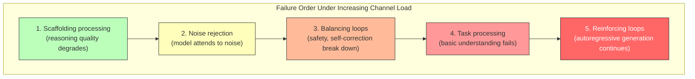

# Information Flow and Context Engineering for LLMs

## The Context Window as a Communication Channel

---

## 1. The Core Question

When we provide context to an LLM to execute a task, we're managing a finite resource. Too little context and the model lacks the information to perform. Too much and performance degrades — not gracefully, but sharply: missed instructions, hallucinated details, loss of coherence. The degradation is measurable and well-documented (see Section 2.2), and it happens far below the nominal context window limit.

**What's actually happening** is attention allocation in a fixed-capacity system. The transformer's self-attention mechanism spreads a finite budget across all tokens in the context. As context grows, each token's share of attention decreases. More critically, irrelevant tokens compete with relevant ones for attention, and the model has no reliable way to ignore them entirely. The result is processing capacity degradation that worsens with both context length and task complexity.

**The right theoretical lens** is information theory. The context window is a *noisy channel* with finite capacity. The task defines an *information rate* — a minimum amount of information that must be processed to produce the correct output. The designer's job is to ensure the information rate of the task stays below the effective capacity of the channel. When it doesn't, the output is unreliable — and unlike a degraded communication link, the failure is often silent.

This chapter develops that lens. The practical interventions it produces — decompose complexity, remove noise, scaffold reasoning — are grounded in the actual mechanism: attention allocation across a finite-capacity channel.

---

## 2. The Information-Theoretic Foundation

### 2.1 The Context Window as a Noisy Channel

Shannon's noisy channel model describes communication through a medium that corrupts information: a sender encodes a message, transmits it through a channel that introduces noise, and a receiver decodes it. The key result — the channel capacity theorem — says that reliable communication is possible only when the information rate stays below the channel's capacity.

In an LLM pipeline, the mapping is direct:

| Channel model | LLM pipeline |
|---------------|-------------|
| **Sender** | The context engineer (or upstream stage) |
| **Encoded message** | The context window contents (artifact + scaffolding + instructions) |
| **Channel** | The transformer's attention mechanism |
| **Noise** | Attention dilution, positional decay, token interference |
| **Decoded message** | The model's output |
| **Receiver** | The downstream stage (or the user) |

The channel has a finite capacity determined by three mechanisms:

- **Attention dilution.** Self-attention spreads a fixed budget across all tokens. As context grows, each token's share decreases. The relationship is worse than linear — attention computation scales quadratically with token count, meaning the effective attention per relevant token degrades faster than the token ratio alone suggests.
- **Positional decay.** Tokens far from the generation point receive less reliable processing. Despite architectural improvements (RoPE, ALiBi, etc.), the effective weight of distant tokens remains lower than nearby ones. Information placed early or late in the context is processed differently than information in the middle — and the pattern varies by model and context length.
- **Token interference.** Tokens don't just passively occupy bandwidth — they actively compete for attention patterns. Tokens that are semantically similar to task-relevant content but carry different information create interference that the model must resolve, consuming processing capacity beyond their token count.

The critical insight: the **nominal context window** (128K, 200K tokens) is not the channel capacity. The **effective capacity** — the amount of information the channel can reliably process for a given task — is dramatically smaller. Research on context rot (Chroma, 2025) demonstrates that many models show severe accuracy degradation by just 1,000 tokens of context, with performance falling far short of their maximum window by >99%.

### 2.2 Signal, Noise, and Interference

Information theory distinguishes between signal (the information you want to transmit) and noise (everything else in the channel). For LLM context engineering, a three-way distinction is more useful:

**Signal** — tokens that carry information necessary for the task. The input artifact, relevant instructions, domain knowledge the model needs, reasoning scaffolding that channels productive processing. Every signal token should have a clear purpose: if you can't name what downstream processing it enables, it may not be signal.

**Noise** — tokens that carry no task-relevant information. Irrelevant retrieved documents, verbose boilerplate, off-topic conversation history, redundant examples, unnecessary metadata. Noise consumes channel bandwidth without contributing to the output. Its cost is roughly linear — each noise token displaces a proportional share of attention from signal tokens.

**Interference** — tokens that carry information that actively conflicts with or confuses the task. Contradictory instructions, outdated information that conflicts with current facts, adversarial content designed to redirect the model, stylistic patterns that pull the output away from the desired format. Interference is qualitatively worse than noise because the model must spend processing capacity *resolving* the conflict, not just ignoring irrelevant content. The capacity cost of interference is super-linear — contradictory tokens are far more expensive than merely irrelevant ones.

The three-way distinction matters because treating all non-productive context as equivalent is misleading. A context window half-full of irrelevant documentation degrades performance. A context window half-full of *contradictory* documentation can cause catastrophic failure — including the collapse of safety mechanisms, as demonstrated by cognitive overload attacks achieving up to 99.99% attack success rates on frontier models.

**The practical heuristic:** Audit context in this order: (1) remove interference first — it's the most destructive per token, (2) remove noise — it's pure waste, (3) then assess whether remaining signal exceeds channel capacity.

### 2.3 Task Complexity as Information Rate

The **information rate** of a task is the minimum amount of information that must be processed to produce the correct output. It is determined by:

- **Logical depth** — the number of sequential reasoning steps required
- **Constraint interaction** — how many constraints must be held in relation simultaneously
- **Integration breadth** — how many distinct information sources must be combined
- **Reasoning chain length** — how far the model must plan ahead to produce a coherent output

A task like "rename this variable" has a low information rate — a single fact lookup and substitution. "Refactor this module to use hexagonal architecture while maintaining backward compatibility with three downstream consumers" has a high information rate — many elements must be held in relation simultaneously, multiple constraints interact, and the reasoning chain is long.

**Key property:** The information rate is a property of the task itself, not of how you present it. You cannot reduce it by better context engineering — you can only reduce it by *decomposing the task* into sub-tasks with lower individual information rates. This is why decomposition is the primary intervention for complex tasks, not better prompting.

In information-theoretic terms: the information rate sets the *minimum* channel capacity required for reliable processing. If the task's information rate exceeds the channel's effective capacity, no amount of noise removal will make it work — the task must be decomposed.

### 2.4 The Capacity Bound

The channel capacity theorem applied to LLM context:

```
Reliable processing requires: task information rate < effective channel capacity
```

Where:

```
Effective capacity ≈ nominal capacity − noise bandwidth − interference cost
```

This is a first-order approximation. The actual relationship is non-linear in several ways:

- **Interference cost is super-linear.** Contradictory context costs more than its token count suggests because the model expends capacity resolving conflicts. A context that's 80% full by token count may have effectively zero remaining capacity if the tokens are contradictory.
- **Catastrophic overload is a phase transition, not a smooth curve.** When effective capacity is exceeded, the failure mode is not gradual degradation but sudden collapse — instruction neglect, safety mechanism failure, hallucination onset. Researchers demonstrated that stacking irrelevant tasks before a harmful query caused models to default to pre-training knowledge rather than safety mechanisms, with collapse happening at a threshold rather than gradually.
- **Positional effects create uneven capacity.** The same information contributes differently to effective capacity depending on where it sits in the context. Early tokens have outsized influence due to autoregressive trajectory commitment. In very long contexts (100k+ tokens), mid-context tokens can contribute less than their count suggests — the "lost in the middle" effect. Modern long-context models have significantly reduced this positional bias, but it remains relevant when operating near capacity limits.

**Practical implication:** Don't rely on token counts for capacity planning. A context that's 50% full by tokens may be at 90% of effective capacity if the tokens include interference, or at 30% if they're well-structured signal. When designing context budgets, err toward more headroom than token-count budgeting suggests, especially for tasks with high information rates.

---

## 3. Stage Boundaries as Rate-Distortion Tradeoffs

When a pipeline passes information between stages through artifacts, it is performing lossy compression. The producing stage has a full internal context — its complete attention state, intermediate reasoning, all the nuance of its processing. The artifact encodes a subset of that information into a structured format that fits the downstream stage's channel.

This is a **rate-distortion** problem. Rate-distortion theory formalises the tradeoff between compression and information loss: the more you compress (lower rate), the more information you lose (higher distortion). The less you compress (higher rate), the more bandwidth you consume in the downstream channel.

### 3.1 Artifacts as Encoded Messages

Every artifact design decision is a rate-distortion decision:

| Design question | Rate-distortion framing |
|----------------|------------------------|
| "What fields does the downstream stage need?" | What must survive compression (distortion constraints) |
| "What can be omitted from the upstream stage's full output?" | What information do we accept losing (distortion budget) |
| "Does the downstream stage need to know *why*?" | Is the processing history part of the signal, or is it noise for the next channel? |
| "Include reasoning trace?" | Is the encoding overhead worth the distortion reduction? |

The **minimality principle** — "artifacts should contain exactly what downstream stages need, no more" — is the rate-distortion optimum. It is the minimum encoding rate that keeps distortion below the downstream stage's tolerance:

- **Over-compressed artifacts** (too few fields, too much omitted): the downstream stage lacks information it needs. The channel is clean but the message is garbled. This manifests as the downstream stage hallucinating details that should have been in the artifact, or making decisions that contradict upstream findings.
- **Under-compressed artifacts** (too many fields, reasoning traces nobody reads): the downstream stage's channel is loaded with noise. The message is intact but the channel is degraded. This manifests as the downstream stage ignoring key artifact fields because they're buried in unnecessary context.

### 3.2 Cumulative Distortion Across Stages

Each stage boundary is a compression-decompression cycle: the producing stage's full context is compressed into an artifact, and the consuming stage decompresses (interprets) it into its own working context. Each cycle introduces some distortion — small interpretation shifts, framing biases, lost nuance.

Across multiple stages, these distortions compound. This is the **Telephone Game** anti-pattern: after 5+ stages of compress-decompress cycles, the late-pipeline artifact may bear little resemblance to the original input. Information theory predicts this: a relay channel (multi-hop communication) accumulates error at each hop, even when each individual hop has low error rate.

**Countermeasures map to information-theoretic techniques:**

- **Enumerated values** (closed sets instead of free text) are **fixed-codebook encoding** — the receiver can only decode to valid codewords, preventing drift. A field with values from `{critical, high, medium, low}` cannot drift the way a free-text severity description can.
- **Source references** (line numbers, verbatim quotes instead of paraphrases) are **forwarding the original signal** rather than re-encoding it. Each stage can decode from the source rather than from the upstream stage's potentially distorted re-encoding.
- **Identity fields** (content that must pass through unchanged) are **uncompressed header fields** — information that bypasses the lossy encoding entirely. Mechanical verification (exact match, hash comparison) provides error detection for these fields.
- **Re-grounding checkpoints** (comparing current artifact against original input) are **error correction against the source signal**. For long pipelines (5+ stages), periodic re-grounding bounds cumulative distortion by comparing the current encoding against the original message.

### 3.3 Gates as Error Detection

In communication systems, error-detection codes verify message integrity after transmission through a noisy channel. They sit at the channel boundary, check the received message against known constraints, and flag corrupted transmissions.

Loop gates serve exactly this function. They sit at stage boundaries — the point where an encoded message (artifact) has just passed through a noisy channel (the LLM stage) — and check whether the message was corrupted.

| Gate type | Error-detection analog | What it catches |
|-----------|----------------------|-----------------|
| **Schema gate** | Parity check | Structural corruption — missing fields, wrong types, malformed output. Cheap, deterministic, catches gross encoding failures. |
| **Metric gate** | Threshold detector | Quantitative corruption — scores below acceptable range, counts outside expected bounds. Cheap, catches systematic under/over-production. |
| **Semantic gate** | Checksum against source | Content corruption — meaning drift, hallucinated claims, misinterpretation. Expensive (requires an inference call), but catches errors that structural checks miss. |
| **Consensus gate** | Redundant transmission | Correlated noise detection — multiple independent channels (evaluators) process the same signal and compare results. Disagreement indicates noise corruption in at least one channel. |
| **Human gate** | Manual inspection | Catches everything, but doesn't scale. Reserved for high-stakes boundaries where automated detection is insufficient. |

**The layering principle follows directly from information theory:** use cheap detection first (parity checks before checksums), and escalate to expensive detection only when cheap checks pass. A schema gate that catches structural corruption before a semantic gate fires saves an inference call. A human gate that fires only when automated gates can't make the call reserves the most expensive detection for cases that need it.

**Silent omission — the undetected error.** The hardest class of corruption to detect is *incomplete* output — an extraction that finds 3 of 10 entities, a summary that covers 2 of 5 key points. The artifact is structurally valid (the encoding format is correct), so parity checks pass. The content looks reasonable, so even checksums may pass. Detecting omission requires **coverage verification** — comparing the output's information content against the input's, which requires the gate to have access to the source signal.

---

## 4. Who Manages What? Anthropic vs. Domain Expert

The information-theoretic framing clarifies the division of responsibility.

### 4.1 What Anthropic Manages (Channel Engineering)

Anthropic's training determines the **channel characteristics** — the capacity, noise floor, and error-correction capabilities of the transformer:

| Channel property | What Anthropic manages | Mechanism |
|-----------------|----------------------|-----------|
| **Capacity** | The model's maximum effective information throughput — how much task complexity it can process reliably | Pre-training scale; architectural improvements; long-context training |
| **Noise floor** | The model's baseline noise — tendency to hallucinate, lose track of instructions, attend to irrelevant tokens | RLHF; Constitutional AI; safety training |
| **Error correction** | Built-in self-correction — the model's ability to catch and fix its own errors during generation | Extended thinking; chain-of-thought training; reward model training |
| **Bandwidth** | The model's ability to process diverse information types — code, natural language, structured data, images | Pre-training data diversity; multimodal training |
| **Interference rejection** | Robustness to contradictory or adversarial context | Safety training diversity; adversarial training |

Training the model is analogous to **engineering a better channel** — higher capacity, lower noise floor, better built-in error correction. A well-trained model has more bandwidth available for any given context.

### 4.2 What the Domain Expert Manages (Encoding and Transmission)

The domain expert (the person designing the context) manages **what information enters the channel and how it's encoded**:

| Encoding concern | What the expert manages | Mechanism |
|-----------------|------------------------|-----------|
| **Signal selection** | Choosing which information to include — the task-relevant content that the model needs | RAG filtering; prompt design; artifact specification |
| **Noise removal** | Keeping irrelevant information out of the channel | Context curation; history management; field pruning |
| **Interference prevention** | Ensuring context doesn't contain contradictions or competing directives | Consistency checking; deduplication; conflict resolution |
| **Encoding efficiency** | Structuring context so the model can route attention effectively | XML tags, clear headers, strategic ordering, structured formats |
| **Rate management** | Ensuring the task's information rate doesn't exceed channel capacity | Task decomposition; staging; progressive disclosure |
| **Scaffolding** | Providing encoding aids that help the model process signal efficiently | Few-shot examples; step-by-step instructions; output format specs |

The expert is the **communications engineer** — they don't build the channel, but they design the encoding scheme, manage the transmission rate, and ensure the message fits the channel's characteristics.

### 4.3 The Shared Boundary

Some responsibilities span both sides:

- **System prompts** — Anthropic trains the model to respond to certain context structures (channel-level), but the content and structure of system prompts is the expert's encoding decision.
- **Tool use** — Anthropic trains the model to use tools (channel capability), but the expert decides which tools and when (encoding strategy).
- **Extended thinking** — Anthropic provides expanded internal processing capacity (channel expansion), but the expert must frame problems to benefit from it (transmission strategy).

---

## 5. Connecting to Feedback Loops

The information-theoretic framing connects directly to the feedback loop dynamics from `feedback-loops-in-llms.md`:

**Noise feeds reinforcing loops.** When the context contains irrelevant tokens, the autoregressive loop can latch onto noise patterns and reinforce them. Attention entropy collapse becomes more likely as the model processes more low-signal tokens — the attention distribution concentrates on a narrowing subset of context against a backdrop of noise. Removing noise is equivalent to *reducing the channel conditions that let reinforcing loops amplify the wrong signal*.

**Signal scaffolding enables balancing loops.** Well-structured reasoning scaffolding (few-shot examples, explicit evaluation criteria, self-check instructions) provides high-signal context that enables self-correction. These are *encoded balancing signals* — they work because they consume channel bandwidth with information that directs the model toward error detection and correction rather than unchecked generation.

**Information rate overload overwhelms balancing loops.** When task complexity exceeds the channel's effective capacity, the engineered balancing loops (safety training, instruction following, self-correction) are the first to fail — exactly as demonstrated by cognitive overload attacks where safety mechanisms collapse under load. The reinforcing loops (autoregressive momentum, pattern lock-in) persist because they ARE the channel architecture, while the balancing loops are higher-order signals that require spare capacity to process.

This produces a critical insight: **the hierarchy of loop robustness under load mirrors the hierarchy of channel utilisation.**



> The reinforcing loops are the last to fail because they ARE the channel.
> The balancing loops fail first because they are signals *within* the channel.

---

## 6. Practical Implications

### For Context Engineers

1. **Audit for interference first, then noise.** Contradictory context is far more destructive per token than merely irrelevant context. Check for conflicting instructions, outdated information, or contradictory examples before trimming verbose-but-harmless content.
2. **Decompose before you elaborate.** If a task is failing, try breaking it into sub-tasks before adding more context. The problem may be information rate overload, not missing information.
3. **Structure context for attention routing.** Clear headers, XML tags, and logical ordering aren't cosmetic — they reduce the processing cost of the model determining what to attend to. They are encoding efficiency improvements.
4. **Front-load the highest-signal information.** Autoregressive trajectory commitment means early context has outsized influence. Put critical instructions and constraints first — they get the best channel conditions.
5. **Provide reasoning scaffolding, not just information.** Examples of desired reasoning patterns (high-signal encoding aids) are more valuable than additional reference material (which may become noise if the channel is already near capacity).

### For Pipeline Designers

1. **Treat the context window as a capacity-constrained channel.** You're maximising signal bandwidth subject to the constraint that total information rate stays below effective capacity — which is much less than the nominal context window.
2. **Design artifacts as rate-distortion-optimal encodings.** Each artifact should compress the upstream stage's output to the minimum rate that keeps distortion below the downstream stage's tolerance. Every unnecessary field wastes downstream bandwidth; every omitted necessary field introduces distortion.
3. **Layer gates as error detection.** Schema gates (cheap parity checks) before semantic gates (expensive checksums) before human gates (manual inspection). Each layer catches what the cheaper layer missed.
4. **Build compaction as a first-class concern.** In agentic loops, context accumulation is a reinforcing loop. Compaction is the balancing mechanism that prevents noise from growing without bound.
5. **Monitor for capacity overload signals.** Instruction neglect, increased hallucination, stylistic drift, and repetition are all indicators that the channel's effective capacity has been exceeded.
6. **Design decomposition strategies, not just bigger contexts.** The temptation to solve information rate overload by increasing context window size is usually wrong. Decomposition reduces the rate; a bigger window increases the capacity — but the capacity increase is less than the token count suggests.

---

## Sources

### Information Theory and LLM Context
- [Context Rot (Chroma Research)](https://research.trychroma.com/context-rot) — Performance degradation with context length: effective capacity far below nominal window
- [Context Length Alone Hurts LLM Performance Despite Perfect Retrieval](https://arxiv.org/html/2510.05381v1) — Channel degradation independent of signal quality
- [The Maximum Effective Context Window for Real World Tasks](https://arxiv.org/pdf/2509.21361) — Empirical measurement of effective channel capacity vs. nominal window
- [Context Discipline and Performance Correlation](https://arxiv.org/html/2601.11564v1) — Quality degradation under varying context lengths

### Context Engineering
- [Effective Context Engineering for AI Agents (Anthropic)](https://www.anthropic.com/engineering/effective-context-engineering-for-ai-agents) — Context as a constrained resource
- [Agentic Context Engineering: Evolving Contexts for Self-Improving LMs](https://arxiv.org/abs/2510.04618) — Dynamic context management
- [Context Engineering Guide (Prompt Engineering Guide)](https://www.promptingguide.ai/guides/context-engineering-guide) — Practical encoding strategies

### Channel Overload and Interference
- [Cognitive Overload Attack: Prompt Injection for Long Context](https://arxiv.org/html/2410.11272v1) — Catastrophic capacity failure under adversarial interference
- [Cognitive Load-Aware Inference: A Neuro-Symbolic Framework](https://arxiv.org/html/2507.00653v1) — Measuring context processing costs per inference
- [United Minds or Isolated Agents](https://arxiv.org/html/2506.06843v1) — Multi-agent information flow dynamics

### Information Theory Foundations
- Shannon, C. E. (1948). "A Mathematical Theory of Communication." *Bell System Technical Journal*, 27(3), 379–423.
- Cover, T. M. & Thomas, J. A. (2006). *Elements of Information Theory*. Wiley-Interscience.
- Berger, T. (1971). *Rate Distortion Theory*. Prentice-Hall — Foundation for lossy compression tradeoffs at stage boundaries.

### Anthropic Training and Alignment
- [Constitutional AI: Harmlessness from AI Feedback (Anthropic)](https://www-cdn.anthropic.com/7512771452629284566b6303311496c262da1006/Anthropic_ConstitutionalAI_v2.pdf)
- [Natural Emergent Misalignment from Reward Hacking (Anthropic)](https://www.anthropic.com/research/emergent-misalignment-reward-hacking)
