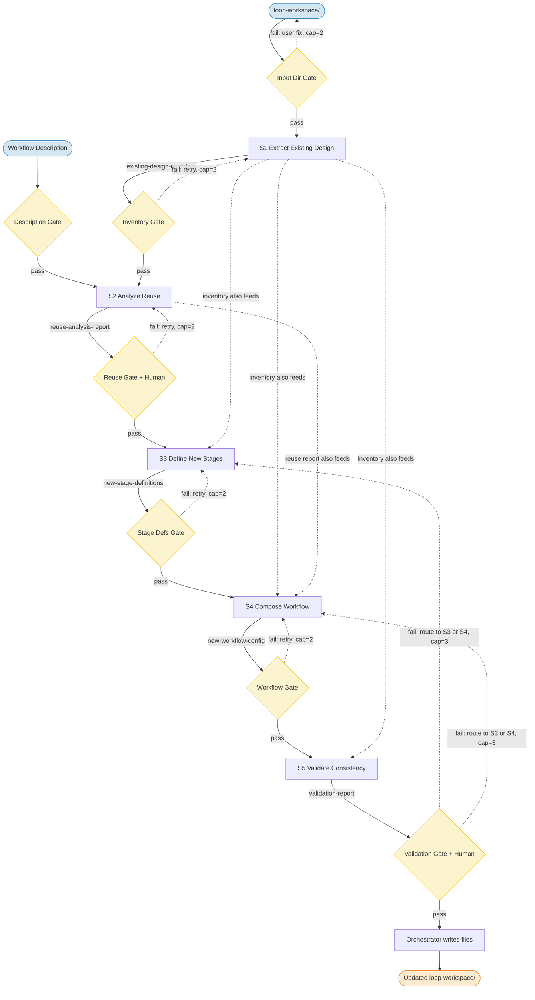
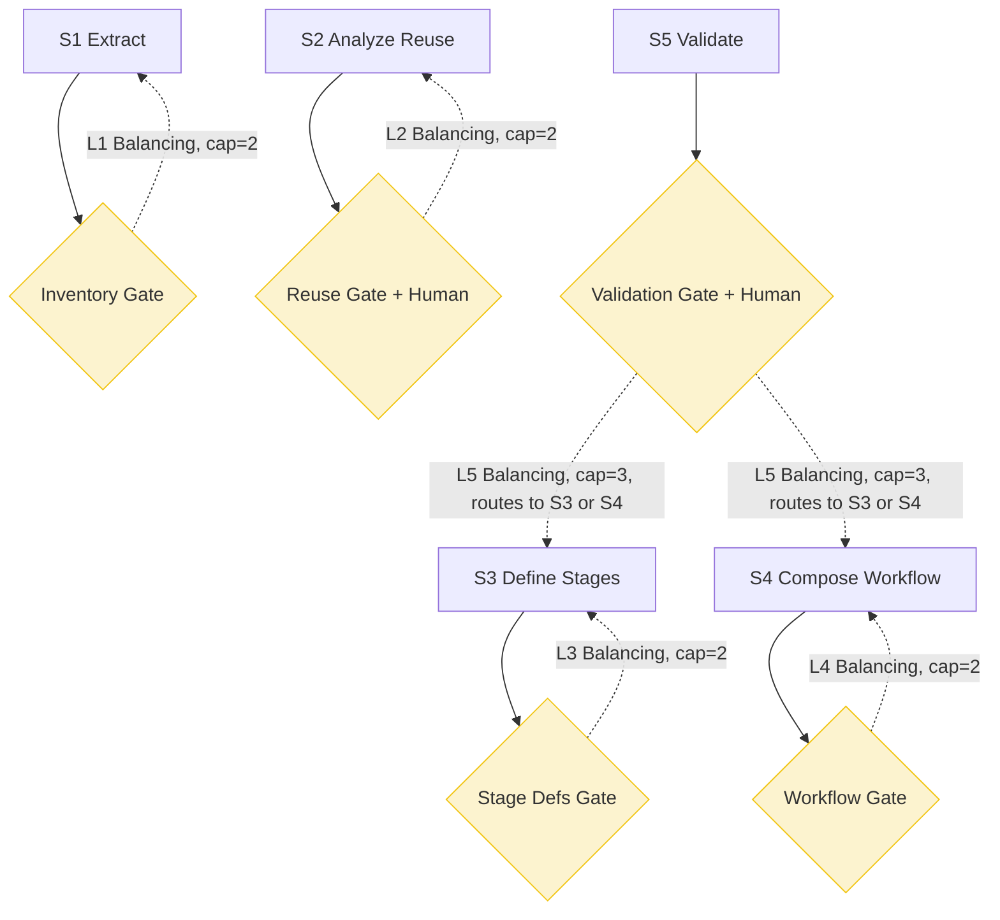

# Pipeline Design: Add Workflow to Existing Loop Pipeline

## Overview

This pipeline extends an existing Loop pipeline design with a new workflow by analyzing stage reuse, incrementally appending new stages to shared artifacts, defining workflow-specific gates and loops, and validating cross-workflow consistency. It has 5 stages, 5 gates (including 2 promoted human gates), and 5 balancing feedback loops. After validation passes, the orchestrator writes files directly — no separate Emit stage. Git provides rollback safety. Intermediate artifacts live in `loop-workspace/workflows/<name>/`.

## Pipeline Flow

## Stages

### S1: Extract-Existing-Design
- **Category**: Extract
- **Intent**: Index the existing pipeline's stages, artifacts, context specs, and workflow configurations
- **Input**: Populated `loop-workspace/` directory
- **Output**: Structured inventory of existing stages (names, categories, contract summaries, domain assumptions), artifacts, context specs, and workflow configurations
- **Sources**: `loop-workspace/` directory contents
- **Sinks**: None
- **Context budget**: Stage file + output contract + source access to workspace files. No history. Process file-by-file if pipeline is large.

### S2: Analyze-Reuse
- **Category**: Evaluate
- **Intent**: Assess each existing stage's applicability to the new workflow's requirements
- **Input**: Existing-Design-Inventory + New-Workflow-Description
- **Output**: Per-stage reuse verdict (`reuse-as-is` or `not-applicable`) with rationale, plus capability gaps requiring new stages
- **Sources**: None
- **Sinks**: None
- **Context budget**: Stage file + output contract + two input artifacts. No raw workspace files. This is the core judgment stage.

### S3: Define-New-Stages
- **Category**: Transform
- **Intent**: Specify new stages needed to fill capability gaps identified in the reuse analysis
- **Input**: Reuse-Analysis-Report (capability gaps) + Existing-Design-Inventory (for collision avoidance)
- **Output**: New stage definitions, artifact contracts, and context specs formatted for append
- **Sources**: None
- **Sinks**: None
- **Context budget**: Stage file + output contract + two input artifacts. Process one gap at a time.

### S4: Compose-Workflow
- **Category**: Synthesise
- **Intent**: Assemble the new workflow's gates and loops from reused and newly defined stages
- **Input**: Reuse-Analysis-Report + New-Stage-Definitions + Existing-Design-Inventory
- **Output**: Gates and loops for the new workflow, plus optional transformation.md scope update
- **Sources**: None
- **Sinks**: None
- **Context budget**: Highest fan-in (3 artifacts). Use inventory summary-level fields. Process gates first, then loops.

### S5: Validate-Consistency
- **Category**: Evaluate
- **Intent**: Verify cross-workflow consistency across all workflows including the new one
- **Input**: Existing-Design-Inventory + New-Stage-Definitions + New-Workflow-Configuration
- **Output**: Validation report (pass/fail with itemized inconsistencies)
- **Sources**: Existing `loop-workspace/` workflow directories
- **Sinks**: None
- **Context budget**: Highest total context load. Process checks by scope category: naming, reference integrity, gate compatibility, context spec compatibility.

### Write Phase (orchestrator-inline)

After Gate 7 passes, the orchestrator performs mechanical file writes directly:
- Append new stages to `stages.md`
- Append new artifact contracts to `artifacts.md`
- Append new context specs to `context-specs.md`
- Write `workflows/<name>/gates.md` and `workflows/<name>/loops.md`
- Optionally update `transformation.md`

No subagent needed — these are deterministic append/create operations.

## Artifacts

| Artifact | Boundary | Key Fields | Identity Fields |
|----------|----------|------------|-----------------|
| Pipeline-Input-Directory | Input → S1 | `workspace_path` | `workspace_path` |
| New-Workflow-Description | Input → S2 | `workflow_name`, `description`, `key_requirements[]` | `workflow_name` |
| Existing-Design-Inventory | S1 → S2, S3, S4, S5 | `stages[]`, `artifacts[]`, `context_specs[]`, `workflows[]` | stage/artifact/workflow names |
| Reuse-Analysis-Report | S2 → S3, S4 | `stage_verdicts[]`, `capability_gaps[]` | `workflow_name`, stage names |
| New-Stage-Definitions | S3 → S4, S5, Write | `new_stages[]`, `new_artifact_contracts[]`, `new_context_specs[]` | stage/artifact names |
| New-Workflow-Configuration | S4 → S5, Write | `gates[]`, `loops[]`, `transformation_update` | `workflow_name`, gate/loop names |
| Validation-Report | S5 → Write | `overall_status`, `checks_performed[]`, `inconsistencies[]` | check names |

## Workflow: design

### Gates

| # | Gate | Position | Type | Pass Criteria | On Fail | Retries |
|---|------|----------|------|---------------|---------|---------|
| 3 | Inventory-Gate | S1 → S2 | Schema+Metric | Complete fields, unique names, valid references | Retry S1 | 2 |
| 4 | Reuse-Gate | S2 → S3 | Schema+Semantic+**Human** | All stages have verdicts, gaps cover requirements; **human confirms** | Retry S2 | 2 |
| 5 | Stage-Defs-Gate | S3 → S4 | Schema+Metric | No collisions, valid gap refs, complete fields | Retry S3 | 2 |
| 6 | Workflow-Gate | S4 → S5 | Schema+Semantic | Valid references, testable criteria, bounded loops | Retry S4 | 2 |
| 7 | Validation-Gate | S5 → Write | Schema+Metric+**Human** | `pass` status; **human confirms writes** | Route to S3 or S4 | 3 |

### Feedback Loops

| # | Loop | Type | Stages | Termination | Cap | Degradation |
|---|------|------|--------|-------------|-----|-------------|
| 1 | Extraction-Correction | Balancing | S1 ↔ G3 | Inventory passes schema+metric | 2 | Violation count must decrease |
| 2 | Reuse-Analysis-Correction | Balancing | S2 ↔ G4 | Verdicts pass schema+semantic+human | 2 | Failure count must decrease |
| 3 | Stage-Definition-Correction | Balancing | S3 ↔ G5 | Definitions pass schema+metric | 2 | Violation count must decrease |
| 4 | Workflow-Config-Correction | Balancing | S4 ↔ G6 | Config passes schema+semantic | 2 | Failure count must decrease |
| 5 | Validation-Correction | Balancing | S5 → G7 → S3 or S4 | `overall_status` is `pass` | 3 | Error count must decrease |

**Nested loop bound**: Loop 5 (cap 3) can trigger Loops 3/4 (cap 2 each), yielding worst-case 9 iterations through the validation path.

## Context Isolation

- All 5 stages run in **fresh subagent context**
- **History policy is `none` for all stages** — no upstream reasoning crosses boundaries
- Semantic gate checks (Gates 4 and 6) run in **dedicated read-only gate-checker context**
- **Channel capacity risks**: S4 and S5 have highest fan-in (3 artifacts). Mitigation: use summary-level fields, process sequentially.
- **Write Phase runs in orchestrator context** — mechanical operations, no judgment needed

## Cost Estimate

| Scenario | Inference Calls | Notes |
|----------|----------------|-------|
| Best case | 12 | 5 stages + 7 gate checks (5 inline + 2 semantic), all pass first attempt |
| Typical | 16 | 1-2 correction loops fire (most likely at Reuse or Validation gates) |
| Worst case | ~48 | All loops at caps including nested L5→L3/L4 paths |

## Review Status

**Verdict**: PASS_WITH_WARNINGS (simplified from original 6-stage design)

Changes from original design:
- Removed Emit-Extended-Design stage (S6) — orchestrator writes files inline after validation
- Removed Gate 8 and Loop 6 — Human gate moved to Gate 7
- Removed `add-workflow-workspace/` — intermediate artifacts live in `workflows/<name>/`
- Reduced from 6 stages/8 gates/6 loops to 5 stages/5 gates/5 loops
