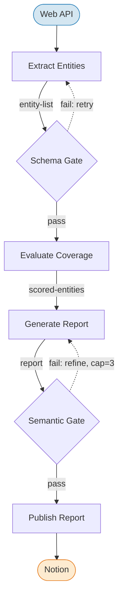

# Loop: Describe Pipeline Design

Read design artifacts from `loop-workspace/` and produce a single, readable markdown document that describes the pipeline — its purpose, stages, data flow, gates, feedback loops, and context isolation model. Includes mermaid diagrams for visual overview.

## Input

Read all available files in `loop-workspace/`. This skill works with whatever exists — it adapts output to what's present. If `$ARGUMENTS` names a workflow, focus on that workflow; otherwise describe all workflows found.

**Stage-level artifacts** (root of `loop-workspace/`):
- `transformation.md` — overall transformation definition
- `stages.md` — stage decomposition
- `artifacts.md` — artifact specifications
- `context-specs.md` — per-stage context budgets

**Workflow-level artifacts** (under `loop-workspace/workflows/<name>/`):
- `gates.md` — gate specifications
- `loops.md` — feedback loop specifications
- `preconditions.md` — external dependency checks

## What You Produce

A file named `loop-workspace/design.md` (or `loop-workspace/workflows/<name>/design.md` if describing a single workflow). This is a **read-only summary** — humans read it to understand the pipeline. It is not consumed by other skills.

## How to Run

### Step 1: Inventory available artifacts

Check which files exist in `loop-workspace/`. Note what's present and what's missing. The document should describe what's been designed so far — don't refuse to produce output because some artifacts are missing.

Minimum requirement: `stages.md` must exist. Without stages there is nothing to describe. If only `transformation.md` exists, tell the user to run `/loop:phase-decompose` first.

### Step 2: Build the pipeline flow diagram

Construct a mermaid flowchart showing the pipeline's stage-to-stage data flow.

**Node mapping:**
- Each **stage** becomes a node, labeled with its name and category
- Each **artifact** between stages becomes an edge label
- **Source dependencies** (external reads) become nodes on the left feeding into their stage, styled distinctly
- **Sink dependencies** (external writes) become nodes on the right receiving from their stage, styled distinctly
- **Gates** (if `gates.md` exists) become diamond decision nodes between the stages they guard — show pass/fail routing
- **Feedback loops** (if `loops.md` exists) become back-edges from the gate or downstream stage back to the target stage, labeled with loop type (R or B) and iteration cap

**Diagram conventions:**
- Flow direction: top to bottom (`TD`)
- Stage nodes: rounded rectangles (default)
- Gate nodes: diamonds `{Gate Name}` — use short, single-line labels only (diamond nodes do not support multi-line text or markdown)
- Source nodes: stadium shape `([Source Name])`
- Sink nodes: stadium shape `([Sink Name])`
- Feedback back-edges: dotted lines with `-.->` notation
- Use `classDef` to visually distinguish sources (blue), sinks (orange), and gates (yellow)
- **No HTML tags** in node labels — mermaid flowcharts do not support `<i>`, `<b>`, `<br>`, etc.
- **No `\n` in labels** — multi-line text inside node labels and edge labels triggers "Unsupported markdown" errors in mermaid renderers. Keep all labels single-line. If a label needs detail, shorten it for the diagram and explain in the text sections below.
- **No markdown-like patterns in labels** — numbered prefixes like `"1. Extract"` are parsed as ordered list syntax, causing "Unsupported markdown: list" errors. Use `"S1 Extract"` instead of `"1. Extract"`.

Example structure (adapt to actual pipeline):

````markdown

````

Keep the diagram readable. For pipelines with more than 8 stages, consider splitting into sub-diagrams by phase or grouping with mermaid subgraphs.

### Step 3: Build the feedback loop diagram (if loops exist)

If `loops.md` exists and the pipeline has non-trivial feedback loops (more than simple retry-on-fail), produce a second mermaid diagram focused on loop dynamics:

- Show only the stages and gates involved in loops
- Label each loop with: type (Reinforcing/Balancing), termination condition, hard cap, and degradation detector
- Show the feedback payload (what information travels back)

This diagram complements the flow diagram — the flow diagram shows the full pipeline with loops as back-edges; this diagram zooms in on loop mechanics.

### Step 4: Write the design document

Assemble the markdown document with these sections. Include only sections for which artifact data exists — don't write empty sections.

```markdown
# Pipeline Design: [Task statement from transformation.md]

## Overview
<!-- 2-3 sentence summary: what the pipeline does, how many stages,
     key characteristics (feedback loops, external dependencies, etc.) -->

## Pipeline Flow
<!-- Mermaid flow diagram from Step 2 -->

## Stages

### [Stage Name]
- **Category**: [Extract | Enrich | Transform | Evaluate | Synthesise | Refine | Emit]
- **Intent**: [Single verb phrase from stages.md]
- **Input**: [What it consumes]
- **Output**: [What it produces]
- **Sources**: [External read dependencies, or None]
- **Sinks**: [External write targets, or None]
- **Context budget**: [From context-specs.md — what's in context, what's excluded]

<!-- Repeat for each stage -->

## Artifacts
<!-- For each artifact boundary, summarize:
     - Key fields and their types (enum, score, free-text, reference)
     - Identity fields (must pass through unchanged)
     - What's deliberately excluded
     Keep this concise — field names and types, not full schemas -->

## Workflow: [name]

### Gates
<!-- For each gate:
     - Position (between which stages)
     - Type (Schema, Metric, Identity, Semantic, Consensus)
     - Pass criteria (one line)
     - Failure route (retry, skip, escalate)
     - Max retries -->

### Feedback Loops
<!-- For each loop:
     - Type (Reinforcing or Balancing)
     - Stages involved
     - Termination condition
     - Hard iteration cap
     - Degradation detector
     - What feedback is carried back -->
<!-- Include the loop detail diagram from Step 3 if produced -->

### Preconditions
<!-- If preconditions.md exists:
     - Required vs optional dependencies
     - What's validated before pipeline start -->

## Context Isolation
<!-- From context-specs.md:
     - Confirm each stage runs in fresh context (subagent delegation)
     - Note any stages with non-default history policy
     - Note that semantic gates run in clean dedicated contexts
     - Flag any deviations from the no-history default -->

## Cost Estimate
<!-- If review.md exists with cost estimates, include them.
     Otherwise, compute: base calls + gate calls + loop worst-case.
     Report as range: best-case – worst-case per input. -->
```

### Step 5: Present the document

Tell the user where the file was written. Note any sections that were thin due to missing upstream artifacts — suggest which `/loop:*` skill to run to fill the gaps.

## Guidance

- **Describe, don't prescribe.** This document reflects the current design. Don't suggest improvements — that's `/loop:review`'s job. If you notice issues, mention them briefly but don't derail the description.
- **Diagrams over prose.** Prefer the mermaid diagram to carry the structural story. The text sections add detail the diagram can't show (context budgets, artifact field types, termination conditions).
- **Keep it current.** This document is a snapshot. If the design changes, re-run `/loop:describe` to regenerate. Don't manually edit `design.md` — it's a derived artifact.
- **Readable by non-designers.** Someone unfamiliar with the Loop framework should be able to read this document and understand what the pipeline does, how data flows, where validation happens, and what can go wrong. Avoid framework jargon without brief explanation.
- **Diagram size limits.** Mermaid diagrams become unreadable past ~15 nodes. For large pipelines, use subgraphs to group related stages, or split into multiple diagrams (e.g., one per workflow phase). Prefer clarity over completeness.
